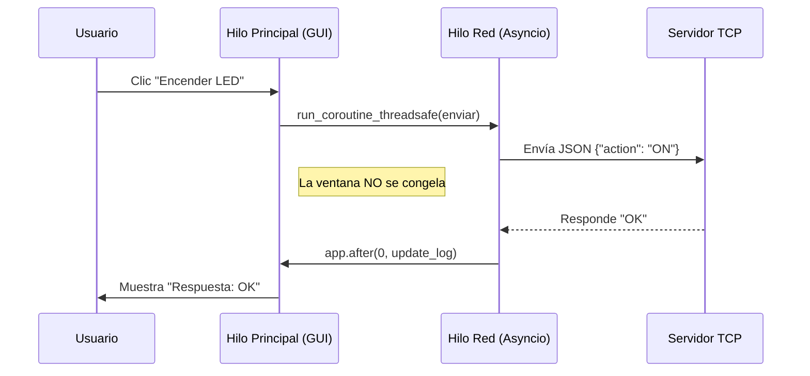

# Arquitectura GUI Asíncrona (CustomTkinter + Asyncio)

## 1. El Desafío
Las interfaces gráficas (GUI) como **Tkinter** tienen su propio bucle infinito (`mainloop`). Si ejecutamos `time.sleep(5)` o una espera de red dentro de un botón, la ventana se congela.

## 2. La Solución: Hilos + Asyncio
Para lograr que la interfaz responda *mientras* enviamos datos por la red, usamos una arquitectura híbrida:

1.  **Hilo Principal (Main Thread):** Ejecuta la GUI (`app.mainloop()`). Dibuja botones y responde a clics.
2.  **Hilo Secundario (Network Thread):** Ejecuta el bucle de `asyncio`. Gestiona la conexión TCP.

## 3. Diagrama de Flujo

## 4. Archivos
*   `gui_server.py`: Servidor TCP simple que escucha en puerto 8080.
*   `gui_app.py`: Aplicación de escritorio moderna.

## 5. Cómo probar
1.  **Terminal 1:** `python3 Python/Playground/Interfaz/gui_server.py`
2.  **Terminal 2:** `python3 Python/Playground/Interfaz/gui_app.py`
