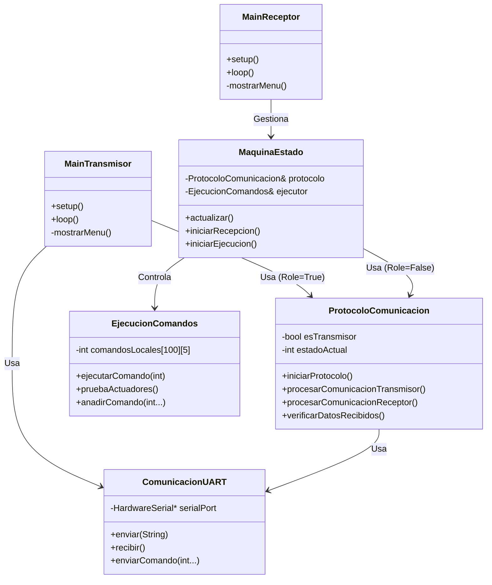

# Arquitectura del Sistema (C++)

Este documento describe la arquitectura del software para los microcontroladores ESP32-S3 encargados del control y comunicación en el proyecto del Invernadero Automatizado.

## Visión General

El sistema se compone de dos nodos principales comunicados vía UART:
1.  **Transmisor (Master):** Encargado de iniciar la comunicación y enviar comandos de control.
2.  **Receptor (Slave):** Encargado de recibir comandos, validar su integridad y ejecutar las acciones sobre los actuadores físicos.

Ambos nodos están implementados en C++ utilizando el framework Arduino sobre PlatformIO.

## Diagrama de Componentes

### Estructura de Clases

La arquitectura de software es modular y comparte una base de código común para la lógica de comunicación, diferenciándose en el punto de entrada (`main`) y el rol asignado.

## Módulos Principales

### 1. Capa de Aplicación (`src/main_*.cpp` y `MaquinaEstado`)
- **Transmisor (`main_transmisor.cpp`):**
    - Mantiene un bucle simple que procesa comandos por consola Serial (Modo Debug) y gestiona el ciclo del protocolo.
    - Envía una secuencia predefinida de comandos de prueba.
- **Receptor (`main_receptor.cpp`):**
    - Implementa una arquitectura basada en estados gestionada por `MaquinaEstado`.
    - Estados: `ESPERA` -> `RECIBIENDO` -> `EJECUTANDO`.
    - Permite control manual y automático de los actuadores.

### 2. Capa de Protocolo (`ProtocoloComunicacion`)
- Abstrae la lógica de intercambio de mensajes.
- Implementa una máquina de estados interna para garantizar la integridad de los datos (Handshake -> Envío -> Verificación).
- Es agnóstica del hardware de comunicación (usa la interfaz `ComunicacionUART`).
- **Verificación de Integridad:** Utiliza un mecanismo de "Eco" donde el receptor devuelve los datos para que el transmisor valide que llegaron correctamente antes de confirmar la ejecución.

### 3. Capa de Hardware/Drivers (`ComunicacionUART` y `EjecucionComandos`)
- **ComunicacionUART:**
    - Wrapper sobre `HardwareSerial` de Arduino.
    - Maneja la configuración de pines (RX: 16, TX: 17) y velocidad (115200 baudios).
    - Formatea los paquetes de datos para su envío.
- **EjecucionComandos:**
    - Mapea los IDs de actuadores lógicos a pines físicos del ESP32.
    - Controla la activación y temporización de los actuadores (Bombas, Luces, etc.).
    - Pines definidos:
        - Actuador 1: Pin 4
        - Actuador 2: Pin 5
        - Actuador 3: Pin 6
        - Actuador 4: Pin 7
        - Actuador 5: Pin 8

## Flujo de Datos

1.  El **Usuario** o la lógica automática carga una lista de comandos en el Transmisor.
2.  El **Transmisor** inicia el handshake (`101`) con el Receptor.
3.  Una vez establecida la conexión (`102`), se envían los paquetes de comandos.
4.  El **Receptor** almacena los comandos en un buffer temporal y los reenvía (`103` + datos) para verificación.
5.  Si el **Transmisor** confirma que los datos son idénticos (`104`), el Receptor mueve los comandos a la cola de ejecución.
6.  El módulo `EjecucionComandos` procesa la cola, activando los pines físicos según la duración especificada.
