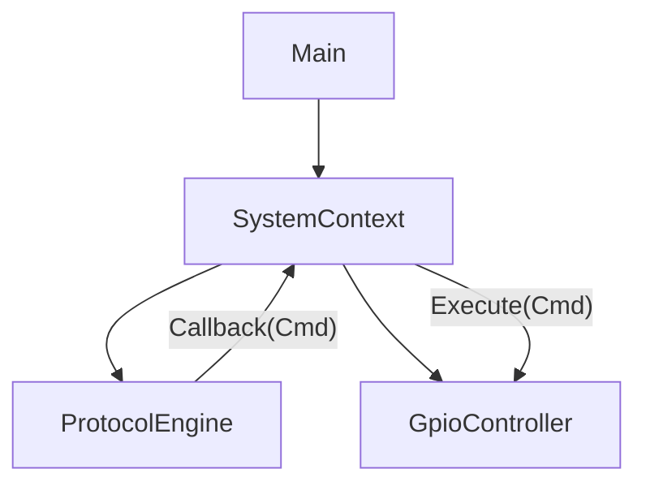

# ADR 001: Controlador de Flujo Centralizado (SystemContext)

**Estado:** Aceptado
**Fecha:** 2026-02-06
**Contexto:** El sistema antiguo usaba una clase `MaquinaEstado` que mezclaba lógica de pines, tiempos y protocolos. Se necesita decidir si reimplementar un control centralizado.

## Decisión
Implementaremos una clase centralizada llamada **`SystemContext`** (o `AppController`), pero con un diseño radicalmente diferente al anterior.

### Diferencias Clave
| Característica | Legacy (`MaquinaEstado`) | Nueva (`SystemContext`) |
| :--- | :--- | :--- |
| **Responsabilidad** | Sabía TODO (tiempos, pines, bytes). | Solo orquesta. No sabe qué hacen los comandos. |
| **Acoplamiento** | Directo (`include "Ejecutor.h"`). | Inyección de Dependencias. |
| **Lógica** | `if (cmd[1] == 1) delay(100);` | `gpio->execute(cmd);` (Delega ciegamente). |

## Estructura Propuesta

## Beneficios
1.  **Testabilidad:** Podemos probar la máquina de estados sin hardware real.
2.  **Claridad:** El `main.cpp` queda limpio (solo `system.update()`).
3.  **Seguridad:** Manejo centralizado de errores (ej. detener todo si falla el protocolo).

## Conclusión
Sí, la máquina de estados es necesaria, pero debe ser un **Orquestador**, no un **Obrero**.
