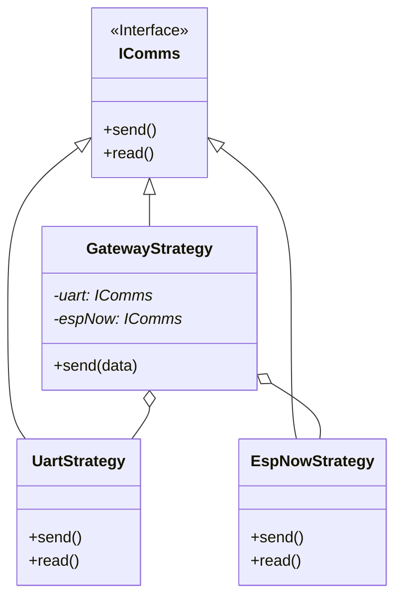

# 3. Capa de Comunicación (Communications Layer)

La capa de comunicación abstrae el medio físico de transmisión de datos. Permite cambiar entre UART, ESP-NOW o LoRa sin modificar una sola línea del `ProtocolEngine` o `SystemContext`.

## 3.1 Interfaz `IComms` (`IComms.h`)

Define el contrato que todas las estrategias deben cumplir. Es una clase abstracta pura.

### Métodos Principales
*   `void send(byte* data, size_t len)`: Envía datos crudos.
*   `bool available()`: Retorna `true` si hay datos para leer.
*   `std::vector<uint8_t> read()`: Retorna todos los datos disponibles en el buffer.
*   `void registerRoute(id, mac)`: (Opcional) Asocia un ID lógico con una dirección física (MAC) para redes mesh/ESP-NOW.

## 3.2 Estrategias Implementadas

### UART (`UartStrategy`)
*   Usa `HardwareSerial` (Serial2 en ESP32).
*   Comunicación punto a punto fiable (cableada).
*   **Uso:** Conexión Gateway <-> Host (PC/Raspberry Pi).

### ESP-NOW (`EspNowStrategy`)
*   Protocolo inalámbrico de Espressif (WiFi a bajo nivel).
*   Sin conexión (Connectionless), baja latencia.
*   Soporta direccionamiento MAC.
*   **Uso:** Conexión Gateway <-> Nodos, Nodo <-> Nodo.
*   **Routing:** Mantiene una tabla interna `std::map<uint8_t, mac_addr>` para traducir ID de Protocolo a MAC de ESP-NOW.

### Gateway (`GatewayStrategy`)
*   Implementación del patrón **Composite**.
*   Contiene instancias de `UartStrategy` y `EspNowStrategy`.
*   **Recepción:** Lee de ambos canales. Si llega por UART, lo pasa al Engine. Si llega por ESP-NOW, también.
*   **Envío (Routing):**
    *   Si el destino es `0` (Master/Host), envía por **UART**.
    *   Si el destino es `> 0` (Nodo), envía por **ESP-NOW**.
    *   Si es Broadcast (`0xFF`), envía por **AMBOS**.

## Diagrama de Estrategia Gateway

