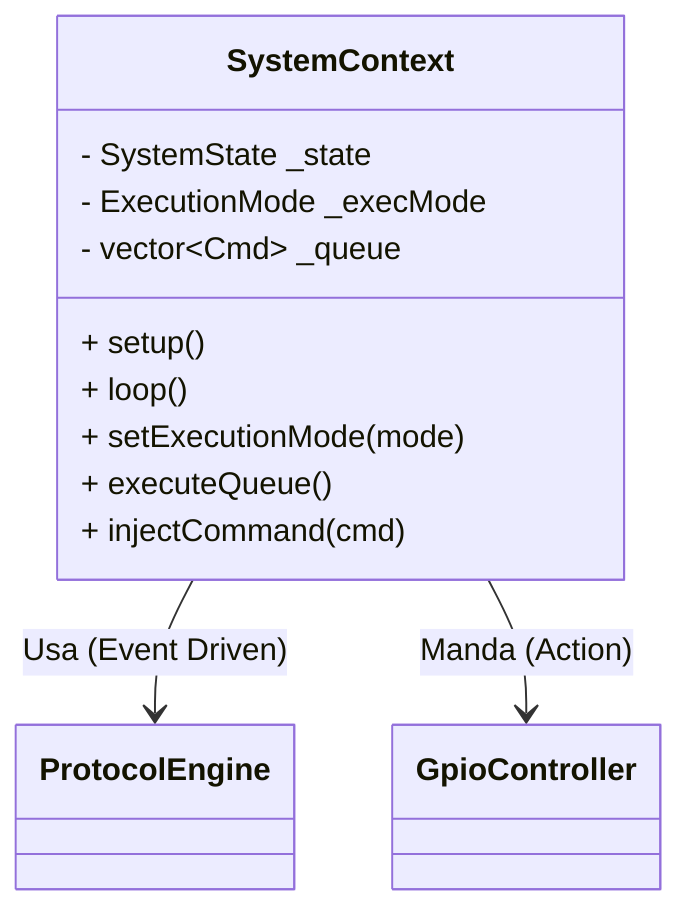

# PRD: System Context & Workflow Controller

## 1. Introducción
El `SystemContext` es el **orquestador central** del firmware del ESP32. Su responsabilidad es desacoplar la lógica de recepción de comandos (`ProtocolEngine`) de la ejecución física (`GpioController`), gestionando el estado del sistema y el modo de operación.

## 2. Objetivos
*   **Centralización:** Un único punto de verdad para el estado del sistema.
*   **Modos de Ejecución:** Permitir cambiar entre ejecución inmediata (baja latencia) y ejecución encolada (sincronización).
*   **Inyección de Dependencias:** Recibe las instancias de `ProtocolEngine` y `GpioController` para facilitar el testing.

## 3. Arquitectura

### 3.1 Diagrama de Clases (Conceptual)

### 3.2 Máquina de Estados (`SystemState`)
1.  **BOOT:** Arranque del sistema. Inicialización de hardware.
2.  **IDLE:** Esperando comandos. Estado por defecto.
3.  **PROCESSING:** Ejecutando una acción (GPIO o Secuencia). Bloquea nuevas acciones inmediatas.
4.  **ERROR:** Estado de fallo seguro. Requiere reinicio.

## 4. Modos de Operación (`ExecutionMode`)

### 4.1 IMMEDIATE (Por Defecto)
*   **Comportamiento:** Al recibir un comando válido del protocolo, se ejecuta al instante.
*   **Uso:** Control manual directo, baja latencia.

### 4.2 INTERACTIVE_QUEUE
*   **Comportamiento:** Los comandos recibidos se guardan en un buffer (`_commandQueue`).
*   **Trigger:** Solo se ejecutan cuando se llama a `executeQueue()` (ya sea por comando serial o botón físico).
*   **Uso:** Preparar una secuencia de cambios y dispararlos todos a la vez.

## 5. Interfaz Pública
*   `setup()`: Configura los callbacks del `ProtocolEngine`.
*   `loop()`: Mantiene vivo el `ProtocolEngine::update()`.
*   `injectCommand(cmd)`: Permite simular la recepción de un comando (usado por el Menú Serial).
