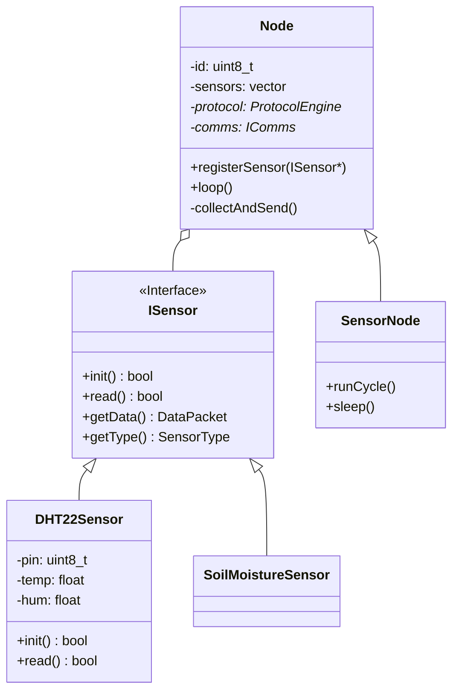

# Especificación Técnica: Sistema Modular de Sensores

## 1. Arquitectura de Software

La arquitectura propuesta utiliza el patrón **Strategy** para los sensores y el patrón **Composite/Component** para el Nodo.



## 2. Definición de Interfaces (C++)

### 2.1 `ISensor` (Abstract Base Class)

```cpp
#pragma once
#include <vector>
#include <string>

// Estructura genérica de datos interna
struct SensorData {
    float value1; // Ej. Temp
    float value2; // Ej. Hum
    // Podríamos usar un union o std::variant en C++17 para ser más flexibles
};

class ISensor {
public:
    virtual ~ISensor() = default;

    // Inicialización del hardware (pinModes, I2C begin, etc)
    virtual bool init() = 0;

    // Lectura del sensor. Retorna true si hubo dato nuevo.
    // Puede ser bloqueante (breve) o no bloqueante (máquina de estados).
    virtual bool read(SensorData& outData) = 0;
    
    // Identificador para logs
    virtual std::string getName() const = 0;
};
```

### 2.2 `Node` (Gestor)

```cpp
class Node {
protected:
    uint8_t _nodeId;
    std::vector<ISensor*> _sensors;
    ProtocolEngine* _engine;

public:
    Node(uint8_t id, ProtocolEngine* engine);
    
    void addSensor(ISensor* sensor);
    
    // Método principal del bucle
    virtual void update(); 
};
```

## 3. Estrategia de Implementación

### 3.1 Gestión de Memoria
*   Los objetos `ISensor` concretos (ej. `DHT22Sensor`) se instanciarán en el `setup()` del Firmware, preferiblemente **estáticamente** o en el Stack del `main` (si no se sale del scope), o en el Heap global una sola vez al inicio.
*   La clase `Node` almacenará punteros a estos sensores (`std::vector<ISensor*>`).
*   No se destruirán sensores durante la ejecución, evitando fragmentación.

### 3.2 Integración con Protocolo
*   El `main` loop llamará a `Node::update()`.
*   Si el nodo es tipo **SensorNode** (deep sleep), el flujo será:
    1.  Despertar.
    2.  `Node::readAll()`.
    3.  Por cada sensor, obtener datos.
    4.  Construir `DataReport` usando `ProtocolEngine`.
    5.  Enviar.
    6.  Esperar ACK (opcional).
    7.  Deep Sleep.
*   Si el nodo es **ActuatorNode** (Always On):
    1.  `Node::update()` llama a `ProtocolEngine::update()` para escuchar.
    2.  Si tiene sensores locales, los lee periódicamente (Timer no bloqueante).

### 3.3 Tipos de Sensores Soportados (Fase 1)
1.  **MockSensor:** Para pruebas sin hardware. Genera ondas senoidales.
2.  **DHTSensor:** Wrapper para librería DHT de Adafruit o similar.

## 4. Plan de Migración

1.  Crear carpeta `src/hardware/sensors`.
2.  Definir `ISensor.h`.
3.  Implementar `MockSensor`.
4.  Crear clase `Node`.
5.  Refactorizar `main_node.cpp` para usar la nueva clase `Node` en lugar de código espagueti.
