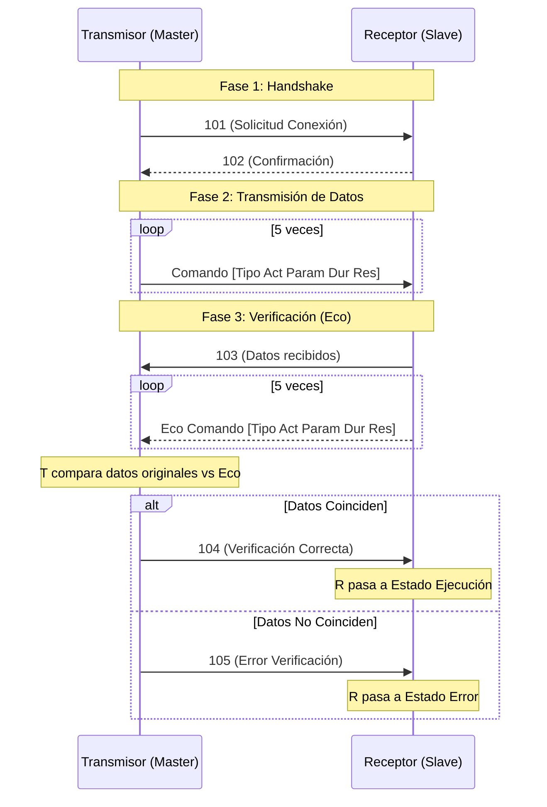

# Protocolo de Comunicación

Este documento define las especificaciones del protocolo de comunicación serial utilizado entre los módulos ESP32 (Transmisor y Receptor).

## Especificaciones Físicas
- **Medio:** UART (Serial2)
- **Baud Rate:** 115200
- **Pines:**
    - RX: GPIO 16
    - TX: GPIO 17
- **Formato:** 8N1 (8 bits de datos, No paridad, 1 bit de parada)

## Estructura de Mensajes
Los mensajes se envían como cadenas de texto ASCII terminadas en espacio o fin de línea. Existen dos tipos de mensajes:
1.  **Códigos de Control:** Un solo entero representing un estado o comando del protocolo.
    - Ejemplo: `101`
2.  **Paquetes de Datos:** 5 enteros separados por espacios.
    - Formato: `[Tipo] [Actuador] [Parametro] [Duracion] [Reservado]`
    - Ejemplo: `1 2 0 1000 0` (Activar Actuador 2 por 1000ms)

## Códigos del Protocolo

| Código | constante (C++) | Origen | Descripción |
|String |---|---|---|
| `101` | `CODIGO_SOLICITUD_CONEXION` | Transmisor | Inicia el proceso de conexión (Handshake). |
| `102` | `CODIGO_CONFIRMACION_CONEXION` | Receptor | Confirma que está listo para recibir (ACK). |
| `103` | `CODIGO_DATOS_RECIBIDOS` | Receptor | Indica que recibió el lote completo (5 comandos) y comienza el Eco. |
| `104` | `CODIGO_VERIFICACION_CORRECTA` | Transmisor | Confirma que los datos devueltos coinciden con los enviados. |
| `105` | `CODIGO_ERROR_VERIFICACION` | Transmisor | Indica discrepancia en los datos devueltos (NACK). |

## Diagrama de Secuencia

El protocolo sigue un flujo estricto de Handshake -> Transmisión -> Verificación (Eco) -> Confirmación.

## Máquina de Estados (ProtocoloComunicacion.cpp)

El protocolo implementa internamente la siguiente máquina de estados para gestionar el flujo:

1.  **ESTADO_INICIAL (0):** Estado de reposo.
2.  **ESPERANDO_CONFIRMACION_102 (1):** Transmisor envió 101, espera 102.
3.  **TRANSMITIENDO_DATOS (2):** Transmisor enviando los 5 paquetes de datos.
4.  **ESPERANDO_103_Y_DATOS (3):** Transmisor terminó de enviar, espera que el Receptor inicie el eco.
5.  **VERIFICANDO_DATOS (4):** Transmisor recibiendo el eco y comparando bit a bit.
6.  **COMUNICACION_COMPLETADA (5):** Éxito total.
7.  **ERROR_COMUNICACION (6):** Fallo en validación.
8.  **ERROR_TIMEOUT (7):** Se excedió el tiempo de espera (10s por defecto) en cualquier paso.

## Manejo de Errores

- **Timeout:** Si el Transmisor no recibe respuesta en ninguna de las etapas (espera de 102, espera de 103) por 10 segundos, pasa a `ERROR_TIMEOUT`.
- **Verificación Fallida:** Si cualquier entero de los paquetes de eco no coincide con el original, el Transmisor envía `105` y aborta la operación.

## Formato de Comandos (Payload)

Cada comando de control consta de 5 valores enteros:

1.  **Tipo:** Clasificador del comando (Ej. 1 = Actuación digital simple).
2.  **Actuador:** ID del dispositivo a controlar (1-5).
3.  **Parametro:** Valor auxiliar (Ej. Intensidad PWM, o 0 para ON/OFF simple).
4.  **Duracion:** Tiempo de activación en milisegundos.
5.  **Reservado:** Para uso futuro o checksum individual.
