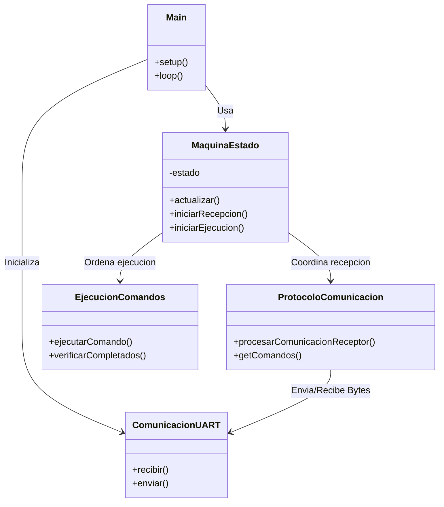

# Arquitectura del Sistema - Firmware C++ (ESP32)

## Visión General
El firmware del ESP32 está diseñado con una arquitectura modular orientada a objetos, separando claramente las responsabilidades de comunicación, lógica de control y manejo de hardware.

## Diagrama de Clases y Flujo

## Flujo de Datos

1.  **Recepción:**
    *   Datos entran por `ComunicacionUART` (Serial2).
    *   `ProtocoloComunicacion` los procesa, valida el Handshake y almacena los 5 comandos.
    *   `MaquinaEstado` supervisa el proceso en estado `RECIBIENDO`.

2.  **Ejecución:**
    *   `MaquinaEstado` pasa a estado `EJECUTANDO`.
    *   Toma el Comando 1 y ordena a `EjecucionComandos` activarlo.
    *   `MaquinaEstado` espera a que `EjecucionComandos` termine (según duración) antes de pasar al Comando 2.

3.  **Seguridad:**
    *   `EjecucionComandos` tiene un mecanismo de seguridad (`verificarCompletados`) para apagar pines si la máquina falla, aunque en operación normal la `MaquinaEstado` tiene prioridad para evitar condiciones de carrera.

## Configuración de Hardware
*   **UART:** Pines 16 (RX) y 17 (TX). Baudrate 115200.
*   **Actuadores:** Pines 4, 5, 6, 7, 8 (Mapeados a IDs 1-5).
