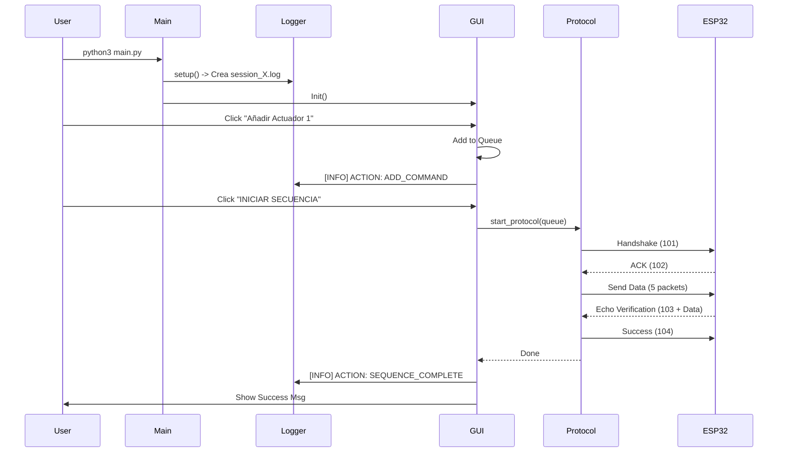

# Arquitectura del Sistema - Controlador Python (Raspberry Pi)

## Visión General
El software de la Raspberry Pi actúa como el "Maestro" del sistema, proporcionando una interfaz de usuario (GUI) y gestionando la comunicación robusta con el ESP32.

## Estructura de Módulos (v2.0)

### 1. Punto de Entrada (`main.py`)
*   **Función:** Orquestador principal.
*   **Responsabilidades:**
    *   Inicializar el sistema de logs (`utils.logger`).
    *   Cargar la configuración (`config.config`).
    *   Lanzar la interfaz gráfica (`gui_controller`).
    *   Manejar excepciones globales.

### 2. Configuración (`config/config.py`)
*   **Función:** Singleton de configuración.
*   **Responsabilidades:**
    *   Cargar `settings.json`.
    *   Proveer rutas absolutas (`LOG_DIR`, `SESSION_LOG_DIR`).
    *   Definir puerto por defecto (`/dev/serial0`).

### 3. Sistema de Logging (`utils/logger.py`)
*   **Filosofía:** Logs basados en Sesión.
*   **Funcionamiento:**
    *   Al arrancar, crea un archivo único: `logs/sessions/session_YYYYMMDD_HHMMSS.log`.
    *   Captura `stdout` y lo envía a consola (INFO) y archivo (DEBUG).

### 4. Interfaz de Usuario (`src/gui_controller.py`)
*   **Tecnología:** Tkinter.
*   **Workflow "Cola de Comandos":**
    1.  **Añadir:** Usuario pulsa botones -> Se añaden a `self.command_queue` (Lista visual).
    2.  **Iniciar:** Usuario pulsa "INICIAR SECUENCIA".
    3.  **Procesar:** La GUI bloquea botones y delega el envío masivo a `ProtocolEngine`.
*   **Instrumentación:** Usa `log_action()` para registrar cada click de forma estandarizada.

### 5. Motor de Protocolo (`src/protocol_engine.py`)
*   **Función:** Lógica pura del protocolo (Handshake -> 5 Comandos -> Verificación).
*   **Uso:** Invocado por la GUI cuando se pulsa "INICIAR".

## Flujo de Trabajo Típico

## Subsistemas Detallados

Para profundizar en los componentes clave, consulta la documentación específica:

*   **[Sistema de Logging](Python_Logging_System.md):** Detalles sobre la arquitectura de sesiones, handlers y niveles.
*   **[Estrategia de Testing](Python_Testing_Strategy.md):** Guía sobre `pytest`, mocks y cobertura de código.

## Configuración y Despliegue
*   **Entorno:** Python 3 + `venv`.

*   **Dependencias:** `pyserial`, `tkinter` (usualmente preinstalado).
*   **Configuración:** `config/settings.json` (creado por `detect_and_save_port.py`).
