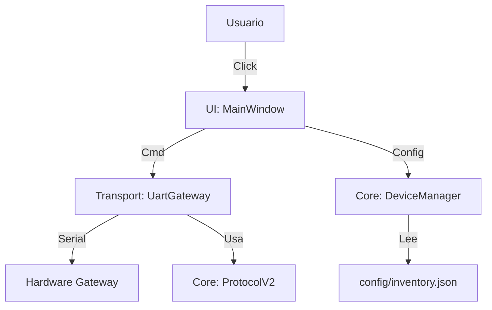

# Manual Técnico: Backend Python (Demeter V2)

**Versión:** 2.0 (Stable)
**Fecha:** 27 Enero 2026
**Ubicación:** `/Python`

## 1. Arquitectura del Sistema
El sistema ha migrado de una colección de scripts sueltos a una **Arquitectura de Micro-Kernel Modular**.

### 1.1 Diagrama de Componentes


---

## 2. Configuración (`config/inventory.json`)
El "Cerebro" del sistema. No existen variables hardcodeadas en el código.

```json
{
    "config": {
        "serial_port": "/dev/serial0",
        "baud_rate": 115200,
        "ui_title": "Demeter Control"
    },
    "devices": {
        "bomba_norte": {
            "node_id": 10,
            "mac": "AA:BB:CC:DD:EE:FF",
            "pin": 4,
            "type": "RELAY"
        }
    }
}
```
*   **config:** Ajustes globales de la aplicación.
*   **devices:** Mapeo de Nombres -> IDs/MACs.

---

## 3. Módulos del Núcleo (`src/`)

### 3.1 Core (`src.core`)
Lógica pura, sin efectos secundarios.

*   **`DeviceManager`:**
    *   Carga `inventory.json`.
    *   Provee métodos `get_target_info(name)` para traducir nombres humanos a direcciones de hardware.
    *   Extrae la Tabla de Rutas (`get_all_routes`) para configurar el Gateway.
*   **`DemeterProtocolV2`:**
    *   Generador de Bytes. Convierte `int` y `list` a tramas binarias `bytes`.
    *   Implementa CRC Checksum simple (`sum % 256`).
    *   Soporta secuencias complejas.

### 3.2 Transport (`src.transport`)
Abstracción del Hardware.

*   **`UartGateway`:**
    *   Ejecuta en un hilo separado (`Threading`).
    *   **Cola de Salida:** `queue.Queue`. La UI deposita mensajes aquí.
    *   **Loop:** Verifica cola -> Envía. Lee Serial -> Verifica Sync (`0xFE`) -> Callback.

### 3.3 UI (`src.ui`)
Interfaz Gráfica.

*   **`MainWindow`:**
    *   Generación dinámica de botones basada en el JSON.
    *   No contiene lógica de negocio, solo invoca al Core.

---

## 4. Estrategia de Testing y Validación

### 4.1 Suite de Pruebas Unificada
Ubicación: `Python/tests/`

Comando para ejecutar todo:
```bash
python3 -m unittest discover Python/tests
```

### 4.2 Tipos de Tests
1.  **Tests Unitarios (`test_protocol_v2.py`):**
    *   Verifican byte a byte que la generación de tramas es perfecta.
    *   Ejemplo: `set_gpio(10, 4, 1)` -> `FE 03 01 00 0A 10 04 01 00 23`.
2.  **Tests de Configuración (`test_device_manager.py`):**
    *   Verifican que el JSON carga bien y el fallback funciona.
3.  **Tests de Integración (`test_simulation_workflow.py`):**
    *   **Simulación End-to-End:** Levanta todo el stack (UI+Core+Transport) y usa un puerto Mock.
    *   Genera un log de trazabilidad completo en `Python/logs/`.

---

## 5. Simulación y Trazabilidad

Para verificar el funcionamiento sin hardware real, el sistema incluye una capacidad de simulación integrada en los tests.

El log generado (`test_simulation_workflow.log`) muestra:
1.  **LOGIC:** Cómo se decide qué ID activar.
2.  **PROTOCOL:** La trama hexadecimal generada.
3.  **PHY:** La transmisión simulada por el cable.

Esta herramienta es vital para depurar antes de conectar equipos caros.
