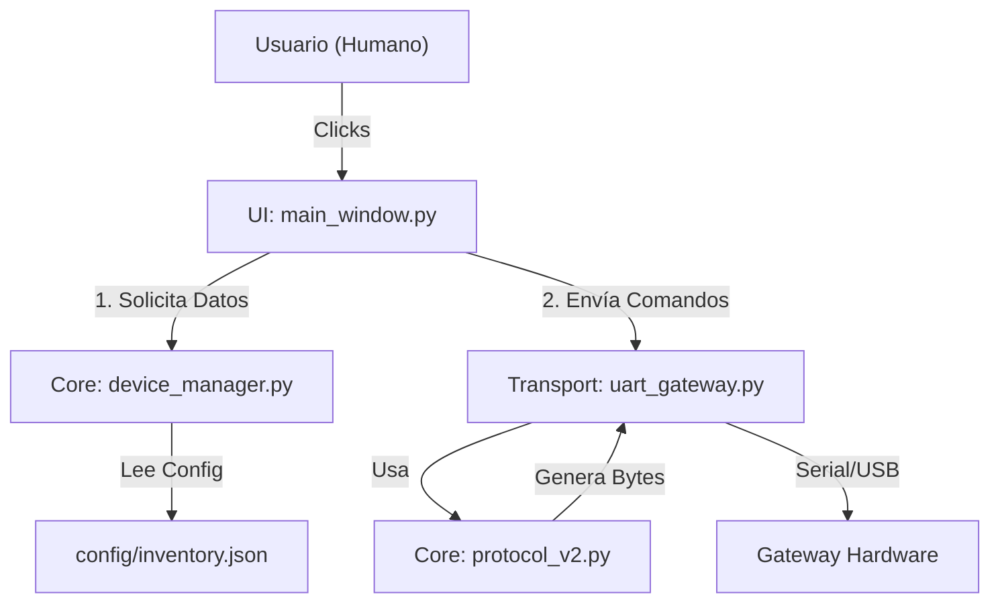

# Visión General del Sistema Python (Arquitectura V2)

Esta documentación describe la arquitectura de alto nivel del Backend de Demeter V2. El sistema ha sido diseñado modularmente para separar preocupaciones y facilitar el mantenimiento.

## Diagrama de Dependencias

## Módulos Principales

### 1. Core (`src/core`)
Cerebro lógico. No tiene dependencias de UI ni de Hardware.
*   **Protocol V2:** Encargado de la matemática binaria (Structs, CRCs).
*   **Device Manager:** Encargado de la "Inteligencia de Negocio" (Nombres -> IDs).

### 2. Transport (`src/transport`)
Capa de abstracción de hardware.
*   **UART Gateway:** Hilo dedicado que gestiona la cola de mensajes para no bloquear el sistema.

### 3. UI (`src/ui`)
Capa de presentación.
*   **Main Window:** Renderiza controles basados en la configuración cargada.

## Flujo de Información (Data Flow)

1.  **Inicio (`main.py`):**
    *   Carga `inventory.json` usando `DeviceManager`.
    *   Lee configuración global (Puerto Serie, Baudrate).
    *   Inicia `UartGateway` y la `UI`.

2.  **Operación Normal:**
    *   Usuario pulsa "Riego ON".
    *   UI pide ID al `DeviceManager` ("Riego" -> ID 10).
    *   UI pide bytes al `Protocol` ("ON Node 10" -> `FE 05...`).
    *   UI pone bytes en la cola del `Gateway`.
    *   `Gateway` envía bytes cuando el puerto está libre.
