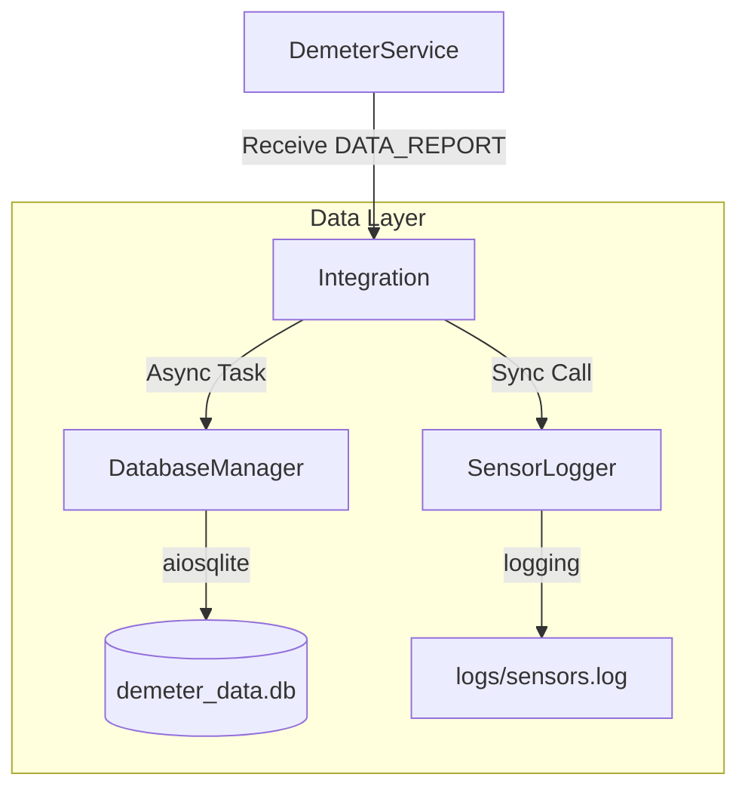

# 4. Capa de Persistencia y Datos (Data Persistence Layer)

## 1. Visión General

La capa de persistencia de Proyecto Demeter tiene como objetivo garantizar que todos los datos telemétricos recibidos de los nodos (sensores) sean almacenados de forma segura, estructurada y redundante. Esta capa opera de manera **asíncrona** para no bloquear el bucle de eventos principal del servicio, permitiendo manejar una alta concurrencia de mensajes.

### Componentes Principales

1.  **DatabaseManager**: Gestiona el almacenamiento estructurado en SQLite.
2.  **SensorLogger**: Gestiona el almacenamiento en archivos planos (CSV) con rotación.
3.  **Data Integration**: Módulo de integración en `DemeterService`.

## 2. Base de Datos (SQLite)

Se utiliza **SQLite** como motor de base de datos debido a su ligereza, portabilidad y suficiencia para el volumen de datos esperado en un entorno de Gateway IoT.

### 2.1 Tecnología

*   **Librería**: `aiosqlite`
*   **Justificación**: Permite realizar operaciones SQL (INSERT, SELECT) utilizando `await`, evitando que las operaciones de disco bloqueen la ejecución del servidor TCP o la recepción UART.

### 2.2 Esquema de Datos (`sensor_readings`)

La tabla principal `sensor_readings` almacena cada medición individual.

| Columna | Tipo | Descripción |
| :--- | :--- | :--- |
| `id` | `INTEGER PK` | Identificador único autoincremental. |
| `timestamp` | `DATETIME` | Fecha y hora exacta de recepción (ISO 8601). |
| `node_id` | `INTEGER` | ID del nodo emisor (según Protocolo V2). |
| `temperature` | `REAL` | Valor de temperatura en °C. |
| `humidity` | `REAL` | Valor de humedad relativa en %. |

### 2.3 Índices y Optimización

Se han creado índices específicos para optimizar las consultas comunes de los dashboards (ej. Grafana):

*   `idx_timestamp`: Acelera consultas por rangos de tiempo (ej. "últimas 24 horas").
*   `idx_node`: Acelera consultas filtradas por nodo específico.

## 3. Sistema de Logging (Flat Files)

Como medida de redundancia y para facilitar análisis rápidos sin herramientas SQL, se implementa un sistema de logging dedicado a sensores.

### 3.1 Configuración (`SensorLogger`)

*   **Ruta**: `logs/sensors.log`
*   **Formato**: CSV (`TIMESTAMP,NODE_ID,TEMP,HUM`)
*   **Rotación**:
    *   Tamaño Máximo: 10 MB
    *   Backups: 5 archivos (`sensors.log.1`, `sensors.log.2`, etc.)
*   **Nivel**: `INFO` (No propaga al log del sistema para mantener la limpieza).

## 4. Integración en el Servicio

La captura de datos ocurre en el método `handle_protocol_command` de `DemeterService`.

### Flujo de Datos
1.  **Llegada**: `AsyncUartTransport` recibe bytes y `DemeterProtocolV2` los decodifica en un objeto `DataReport`.
2.  **Disparo**: Si el comando es válido, se invoca la lógica de persistencia.
3.  **Ejecución**:
    *   **DB**: Se programa una tarea (`asyncio.create_task`) para insertar en SQLite.
    *   **Log**: Se escribe inmediatamente en el buffer del archivo de log.
4.  **Broadcast**: Paralelamente, el datos se envía vía TCP a la GUI en tiempo real.

## 5. Testing y Validación

El subsistema cuenta con una suite de pruebas de integración en `Python/tests/test_data_integration.py` que verifica:

1.  **Inicialización**: Creación automática de tablas y directorios.
2.  **Escritura**: Inserción correcta de registros y líneas de log.
3.  **Integridad**: Que los datos recuperados coincidan con los insertados (precisión decimal, timestamps).
4.  **No Bloqueo**: Que las operaciones se ejecuten dentro del loop de asyncio sin errores.
