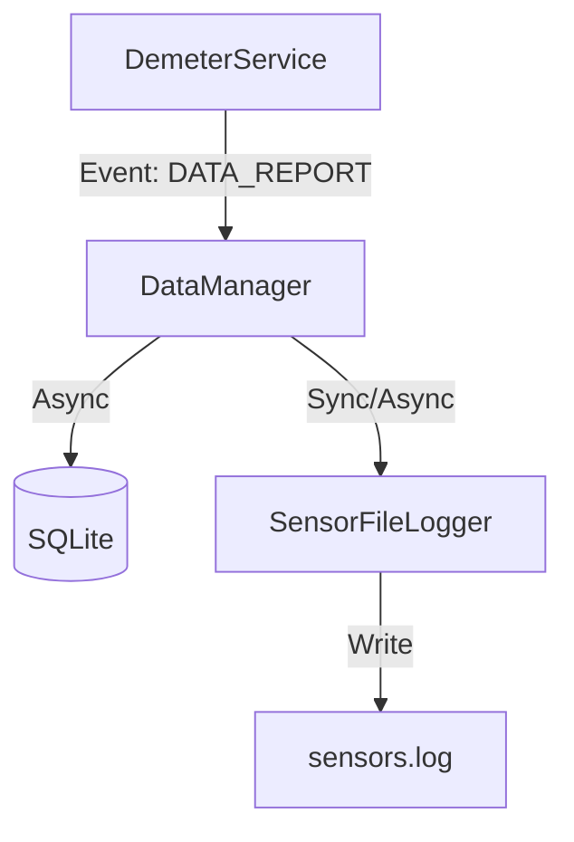

# Especificación Técnica: Python Data Layer

## 1. Arquitectura

Se añade un nuevo paquete `proyecto_demeter.data` que contiene los gestores de persistencia.



## 2. Componentes

### 2.1 `DatabaseManager` (Clase)

Encapsula el acceso a SQLite. Usaremos `aiosqlite` para soporte nativo `async/await`.

```python
class DatabaseManager:
    def __init__(self, db_path: str):
        self.db_path = db_path

    async def init_db(self):
        """Crea tablas si no existen."""
        
    async def save_reading(self, node_id: int, temp: float, hum: float):
        """Inserta registro."""
        
    async def get_stats(self, start_time, end_time) -> dict:
        """Retorna avg/min/max."""
```

### 2.2 `SensorLogger` (Clase)

Maneja el logging a archivo de texto.

```python
class SensorLogger:
    def __init__(self, log_path: str):
        # Configurar logging standard de Python con FileHandler
        self.logger = logging.getLogger("sensors")
        
    def log_reading(self, node_id: int, temp: float, hum: float):
        self.logger.info(f"{timestamp},{node_id},{temp},{hum}")
```

## 3. Esquema de Base de Datos

```sql
CREATE TABLE IF NOT EXISTS sensor_readings (
    id INTEGER PRIMARY KEY AUTOINCREMENT,
    timestamp DATETIME DEFAULT CURRENT_TIMESTAMP,
    node_id INTEGER NOT NULL,
    temperature REAL,
    humidity REAL
);

-- Índices para optimizar consultas por tiempo y nodo
CREATE INDEX IF NOT EXISTS idx_timestamp ON sensor_readings(timestamp);
CREATE INDEX IF NOT EXISTS idx_node ON sensor_readings(node_id);
```

## 4. Integración en `DemeterService`

En `async_service.py`:

```python
# Inicialización
self.data_manager = DatabaseManager("data/demeter.db")
await self.data_manager.init_db()

# En handle_protocol_command (DATA_REPORT)
await self.data_manager.save_reading(src_id, temp, hum)
```
