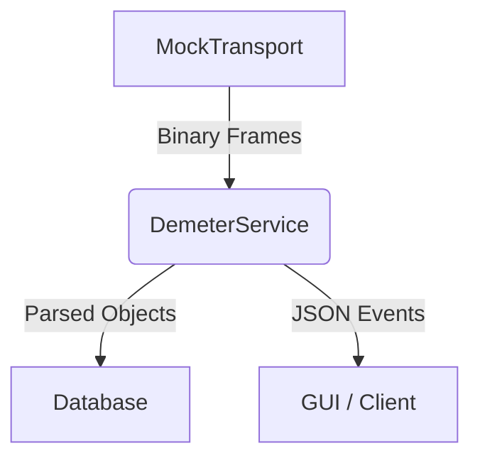

# 🧪 Mock Simulation Mode PRD

> **Status**: Planned
> **Feature Branch**: `feature/mock-simulation-mode`

## 1. Overview
The **Mock Simulation Mode** allows developers to run the entire Demeter Python Backend on a standard PC (Linux/Mac/Windows) without Physical UART hardware or Sensor Nodes. 

Unlike the previous "Mock Flag" which mainly suppressed errors, this feature introduces a **Proactive Data Generator** that simulates a living network of nodes.

## 2. Goals
1.  **Visualize Data**: The GUI should receive `DataReport` packets as if they were coming from real sensors.
2.  **Test Logic**: Protocol parsing, Database storage, and WebSocket/TCP broadcasting should be exercised exactly as in production.
3.  **Zero-Hardware Development**: Enable UI and Logic development on the train/plane/cafe.

## 3. Architecture

### Current (Simulated)

### The `MockTransport` Class
Instead of `AsyncUartTransport`, we inject `MockTransport` when `DEMETER_MOCK=true`.

**Responsibilities:**
*   **Simulate RX**: Generate valid Protocol V2 Binary Frames (SYNC, LEN, PAYLOAD, CRC).
*   **Simulate Nodes**: Simulate 1-3 nodes (ID 10, 11, 12) sending data every 5 seconds.
*   **Simulate Physics**: Random walk temperature/humidity values to look realistic.
*   **Log Replay (Optional)**: Future capability to replay `session.log` files.

## 4. Implementation Details

### 4.1. `MockTransport` Interface
Must implement the same methods as `AsyncUartTransport` (duck typing or abstract base):
*   `connect()`: Returns True immediately.
*   `send(data)`: Logs the TX data bytes (echo/loopback optional).
*   `set_callback(func)`: Stores the callback to push RX data.
*   `close()`: Stops the simulation task.

### 4.2. Configuration
*   **Trigger**: `DEMETER_MOCK=true` or passed via CLI `--mock`.
*   **Settings**: 
    *   `MOCK_NODE_COUNT`: Number of simulated nodes (Default: 3).
    *   `MOCK_INTERVAL`: Seconds between reports (Default: 2.0).

## 5. Success Criteria
*   [ ] `main_async.py --mock` starts without errors.
*   [ ] GUI connects via localhost.
*   [ ] GUI displays moving temperature graphs.
*   [ ] `demeter_data.db` grows with mock records.
