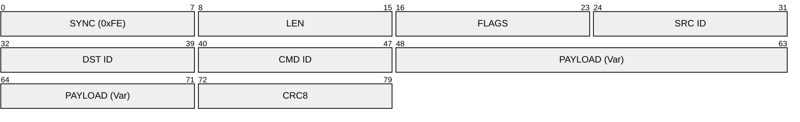
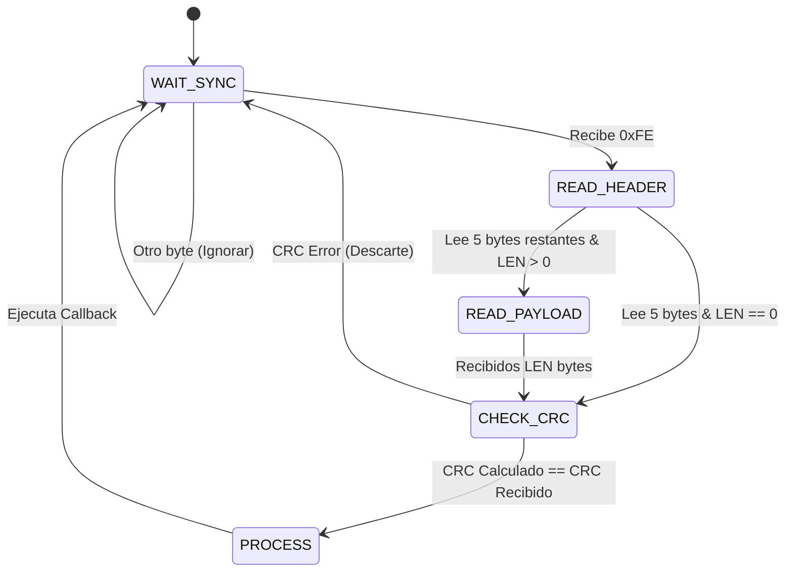

# Ciclo de Vida de una Trama (Byte-Level Detail)

Este documento detalla qué sucede exactamente en el cable (o aire) cuando se envía un comando desde el Servidor hasta un Nodo.

## 1. Estructura de la Trama (Binaria)
El protocolo Demeter V2 utiliza una estructura de trama fija para maximizar la eficiencia y robustez.



| Byte | Campo | Descripción |
| :--- | :--- | :--- |
| 0 | **SYNC** | Siempre `0xFE` (254). Marca el inicio de una transmisión válida. |
| 1 | **LEN** | Longitud del Payload (0-255 bytes). No incluye cabecera ni CRC. |
| 2 | **FLAGS** | Bits de control (e.g., `0x01` = Requiere ACK). |
| 3 | **SRC** | ID del Emisor (e.g., `0x00` = Servidor). |
| 4 | **DST** | ID del Receptor (e.g., `0x01` = Gateway). |
| 5 | **CMD** | ID del Comando (e.g., `0x10` = SET_GPIO). |
| 6..N | **PAYLOAD** | Datos específicos del comando. |
| N+1 | **CRC** | Checksum simple (Suma % 256) de todo menos SYNC. |

---

## 2. Caso de Uso Real: Encender LED (SET_GPIO)
Analicemos la transformación de datos desde la GUI hasta el cable.

### Paso 1: Interfaz (JSON)
El usuario hace clic en "ENCENDER". La GUI envía este JSON al Servicio:
```json
{
  "type": "GPIO_CMD",
  "pin": 2,
  "action": "ON"
}
```

### Paso 2: Serialización (Pydantic -> Bytes)
El Servicio valida el JSON y crea un objeto `SetGpio`. El `ProtocolEngine` lo transforma a bytes.

**Valores:**
*   **Target**: 1 (Gateway)
*   **Pin**: 2
*   **Value**: 1 (ON)
*   **Flags**: 0

**Cálculo de CRC:**
Suma de bytes (Header fields + Payload): `03 + 01 + 00 + 01 + 10 + 02 + 01 + 00 = 24 (0x18)`

### Paso 3: En el Cable (Hexdump)
Esta es la secuencia exacta de bytes que viaja por UART (`/dev/ttyUSB0`):

`FE 03 01 00 01 10 02 01 00 18`

**Desglose:**
*   `FE`: **SYNC**
*   `03`: **LEN** (3 bytes de payload)
*   `01`: **FLAGS** (ACK Request)
*   `00`: **SRC** (Server)
*   `01`: **DST** (Gateway)
*   `10`: **CMD** (SET_GPIO)
*   `02`: **PIN** (Payload Byte 0)
*   `01`: **VAL** (Payload Byte 1)
*   `00`: **FLG** (Payload Byte 2)
*   `18`: **CRC**

---

## 3. Máquina de Estados del Parser (Firmware)
El Firmware no lee toda la trama de golpe; usa una máquina de estados finitos para procesar byte a byte y evitar bloqueos.



1.  **WAIT_SYNC**: Descarta ruido hasta encontrar `0xFE`.
2.  **READ_HEADER**: Lee longitud, origen, destino y comando.
3.  **READ_PAYLOAD**: Acumula `LEN` bytes en un buffer.
4.  **CHECK_CRC**: Valida la integridad. Si falla, descarta todo silenciosamente (o loguea error).
5.  **PROCESS**: Despacha la acción (e.g., `digitalWrite(2, HIGH)`).
