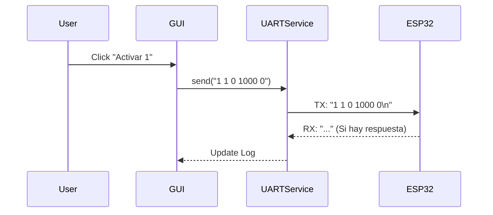

# Arquitectura del Sistema - Controlador Python (Raspberry Pi)

## Visión General
El software de la Raspberry Pi actúa como el "Maestro" del sistema, proporcionando una interfaz de usuario (GUI) y gestionando la comunicación robusta con el ESP32.

## Estructura de Módulos

### 1. Interfaz de Usuario (`gui_controller.py`)
*   **Tecnología:** Tkinter (Biblioteca estándar de Python).
*   **Función:** Provee botones para activar actuadores manualmente.
*   **Interacción:** Instancia `UARTService` para enviar comandos directos cuando el usuario interactúa.
*   **Formato de Comando:** Envía strings formateados como `200 1 {id} 0 {duracion} 0` para ejecución directa (Nota: El soporte de código 200 fue revertido en firmware v1.1, volviendo al protocolo estándar o comandos manuales simples si se desea).

### 2. Motor de Protocolo (`protocol_engine.py`)
*   **Función:** Implementa la lógica espejo del `ProtocoloComunicacion` de C++.
*   **Uso:** Se utiliza principalmente en los scripts de prueba (`main_poc.py`) para validar secuencias completas de 5 comandos con verificación.
*   **Estados:** Maneja el Handshake (101->102) y la verificación de Eco (103->104).

### 3. Servicio UART (`uart_service.py`)
*   **Función:** Abstracción de bajo nivel sobre `pyserial`.
*   **Características Clave:**
    *   Logging de bytes crudos (Hexadecimal) para depuración de ruido eléctrico.
    *   Manejo de reconexiones y errores de puerto.
    *   Configuración centralizada de puerto (`/dev/ttyS0` por defecto).

## Flujo de Trabajo Típico (GUI)

## Configuración y Despliegue
*   **Entorno:** Python 3 + `venv`.
*   **Dependencias:** `pyserial`, `tkinter` (usualmente preinstalado).
*   **Configuración:** `config/settings.json` (creado por `detect_and_save_port.py`).
