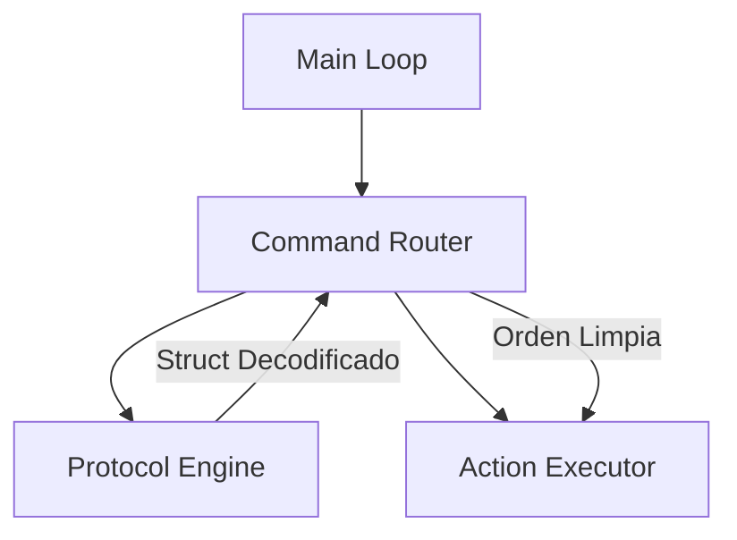

# FAQ 02: Arquitectura de Datos y Abstracción en C++

**Pregunta del Usuario:**
> *"¿Debería separar Monitorización de Tráfico y Protocolo? ¿Debería usar una clase orquestadora por encima? ¿Debería el Ejecutor recibir tramas crudas o usar un lenguaje interno abstracto?"*

## 1. Monitorización vs. Protocolo (Separación de Responsabilidades)
**Respuesta:** SÍ, sepáralos.
*   **`HardwareStrategy` (Monitorización):** Se encarga de contar bytes, detectar errores de paridad, gestionar buffers y timeouts físicos. Es el "Conductor del Camión".
*   **`ProtocolEngine` (Lógica):** Se encarga de verificar CRC, desempaquetar el Payload y entender qué significa. Es el "Logístico que abre las cajas".

Mantenerlos separados te permite cambiar el camión (UART -> LoRa) sin cambiar al logístico.

## 2. Orquestación: ¿Quién manda?
**No uses `MaquinaEstado` para todo.**
Si metes la lógica de comunicaciones dentro de la Máquina de Estados principal del sistema, crearás un "Monstruo" (God Object).

**Mejor estructura:**

El `CommandRouter` (o `SystemController`) sirve de puente. Recibe mensajes limpios del Protocolo y se los pasa al Ejecutor.

## 3. ¿Tramas Crudas o Lenguaje Interno? (La Pregunta del Millón)
**Respuesta Definitiva:** USA UN LENGUAJE INTERNO (Structs).

### Opción A: Ejecutor recibe Bytes (MALA IDEA)
El Ejecutor recibe `b'\xFE\x10\x04\x01...'`.
*   **Problema:** El Ejecutor tiene que saber parsear binario. Si mañana cambias el protocolo V2 a V3, tienes que reescribir el Ejecutor de GPIOs. ¡Acoplamiento fuerte!

### Opción B: Ejecutor recibe Structs (BUENA IDEA)
Defines un "Leguaje Común" en C++ (equivalente a tus modelos Pydantic):

```cpp
// internal_types.h
struct SetGpioCmd {
    uint8_t pin;
    bool value;
};
```

1.  **ProtocolEngine:** Lee bytes -> `SetGpioCmd`.
2.  **Executor:** Recibe `SetGpioCmd` -> `digitalWrite(cmd.pin, cmd.value)`.

**Ventaja:** El Ejecutor es tonto. Solo sabe encender pines. No sabe si la orden vino por WiFi, por cable o por telepatía. El Protocolo se encarga de traducir "Idioma Cable" a "Idioma Interno".

## Recomendación Final
1.  **Capa 1 (Física):** `UartStrategy` (Bytes crudos).
2.  **Capa 2 (Traducción):** `ProtocolEngine` (Bytes -> Structs).
3.  **Capa 3 (Ejecución):** `GpioController` (Structs -> Hardware).

Esto es arquitectura limpia y mantenible a largo plazo.
