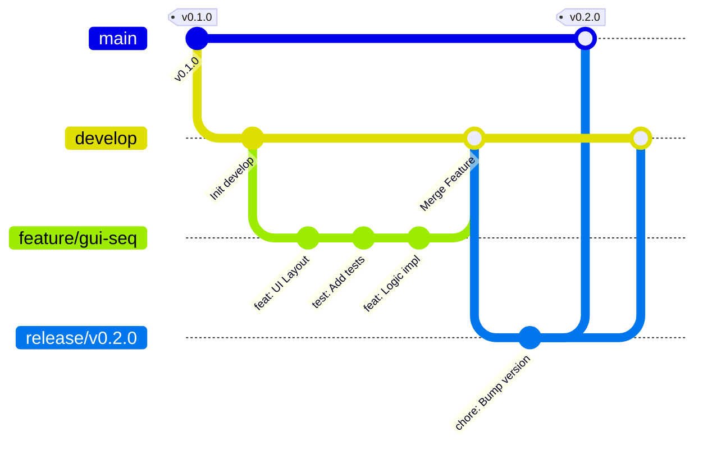

# Ciclo de Vida del Desarrollo de Software (SDLC) con Git

Este documento describe el flujo de trabajo estándar para desarrollar nuevas funcionalidades en `Proyecto_Demeter`, asegurando calidad, trazabilidad y estabilidad.

## 1. Filosofía: Feature Branch Workflow

El principio básico es simple: **Nunca trabajes directamente en `main` o `develop`**. Todo cambio debe nacer, vivir y revisarse en una rama dedicada.

### 1.1 Ramas Principales
*   **`main` (o `master`):** Código de producción estable. Lo que está aquí SIEMPRE debe compilar y funcionar. Solo recibe cambios via Merge Request desde `develop` (Release) o `hotfix`.
*   **`develop`:** Rama de integración. Aquí se mezclan las nuevas features terminadas. Es la base para la próxima versión.

### 1.2 Ramas Temporales
*   **`feature/nombre-de-la-feature`:** Donde ocurre el desarrollo diario. Nace de `develop`, muere al mergearse en `develop`.
*   **`bugfix/nombre-del-bug`:** Para corregir errores no críticos en `develop`.
*   **`hotfix/nombre-del-hotfix`:** Para corregir errores críticos en `main` (Producción).
*   **`release/vX.X.X`:** Rama de preparación para una nueva versión. Nace de `develop`, muere al mergearse en `main` y `develop`.

---

## 2. El Flujo Paso a Paso

### Paso 1: Ideación y Planificación
Antes de escribir una línea de código:
1.  **Definir la Funcionalidad:** ¿Qué queremos hacer? (Ej: "Planificador de Tiempos en GUI").
2.  **Crear PRD (Opcional pero Recomendado):** Documentar requisitos y diseño técnico en `docs/PRD/`.
3.  **Crear Tareas:** Desglosar en tareas pequeñas (Ej: "Crear UI", "Crear Modelo de Datos", "Testear envío").

### Paso 2: Crear la Rama (Feature Branch)
Asegúrate de tener lo último de `develop`.

```bash
git checkout develop
git pull origin develop
git checkout -b feature/gui-sequencer
```

### Paso 3: Desarrollo Iterativo (TDD / BDD)
Aquí aplicas el ciclo de código:
1.  **Escribir Tests (Rojo):** Crea un test que falle porque la funcionalidad no existe.
2.  **Implementar (Verde):** Escribir el código mínimo para pasar el test.
3.  **Refactorizar:** Limpiar y optimizar el código.
4.  **Documentar:** Añadir Docstrings/Doxygen y actualizar documentación.

**Commits Semánticos:**
Usa prefijos claros:
*   `feat: Nueva ventana de secuenciador`
*   `fix: Error en cálculo de tiempos`
*   `docs: Actualizar PRD del secuenciador`
*   `test: Añadir unit test para payload`

### Paso 4: Revisión (Pull Request / Merge Request)
Cuando la feature está lista:
1.  Sube tu rama: `git push origin feature/gui-sequencer`.
2.  Abre un PR hacia `develop`.
3.  **Revisión de Código:** Otro desarrollador (o tú mismo con otro sombrero) revisa:
    *   ¿Pasan los tests?
    *   ¿Cumple el PRD?
    *   ¿El código es limpio?

### Paso 5: Merge e Integración
Si todo está OK, se hace el merge a `develop`.
```bash
git checkout develop
git merge feature/gui-sequencer
git push origin develop
```
*Ahora tu feature es parte oficial del proyecto en desarrollo.*

### Paso 6: Release (Publicación)
Cuando has acumulado suficientes features en `develop` para una versión (ej. v0.2.0):
1.  Crear rama `release/v0.2.0` desde `develop`.
2.  Bump de versión en archivos (setup.py, version.h).
3.  Tests finales de integración.
4.  Merge a `main` y etiquetar (`git tag v0.2.0`).
5.  Merge back a `develop` (para que develop sepa que ya salió la v0.2.0).

---

## 3. Resumen Gráfico


