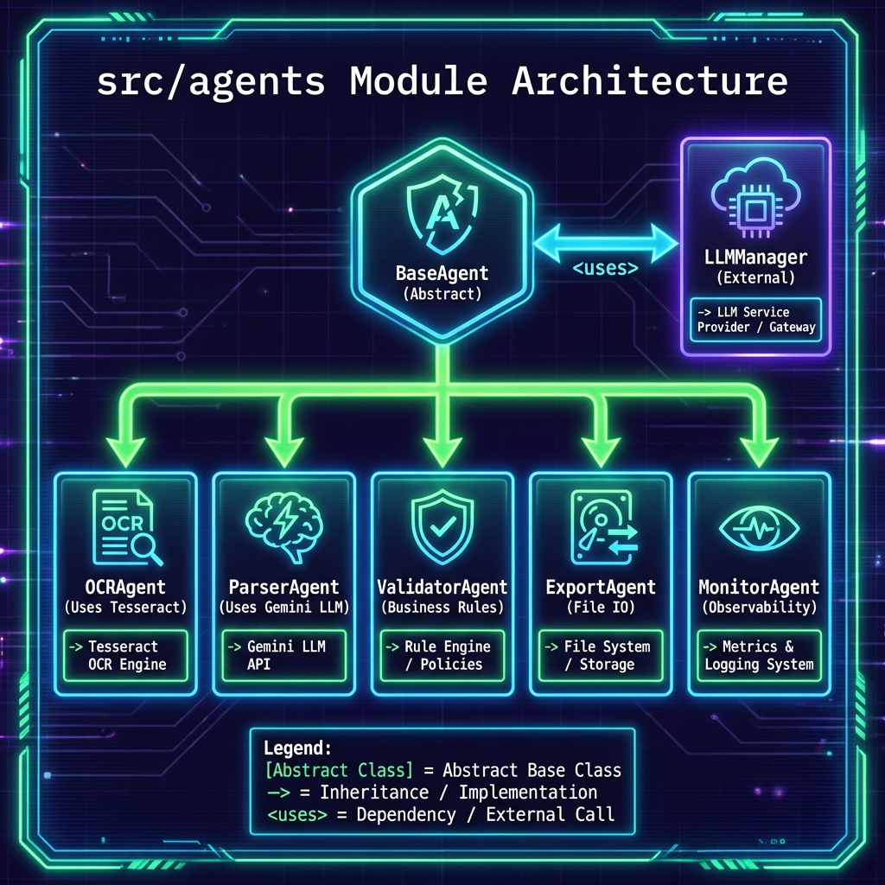

# Especificación Técnica: Sistema de Agentes

3. ## 📋 Índice
4. 1. [Descripción General](#descripcion-general)
5. 2. [Arquitectura de Agentes](#arquitectura-de-agentes)
6. 3. [Especificación de Agentes](#especificacion-de-agentes)
7.     - [Base Agent](#base-agent)
8.     - [OCR Agent](#ocr-agent)
9.     - [Parser Agent](#parser-agent)
10.     - [Validator Agent](#validator-agent)
11.     - [Export Agent](#export-agent)

---

## Descripción General {#descripcion-general}

[...]

## Arquitectura de Agentes {#arquitectura-de-agentes}

[...]

## Especificación de Agentes {#especificacion-de-agentes}

### OCR Agent {#ocr-agent}

[...]

### Parser Agent {#parser-agent}

[...]

### Validator Agent {#validator-agent}

[...]

### Export Agent {#export-agent}

[...]
