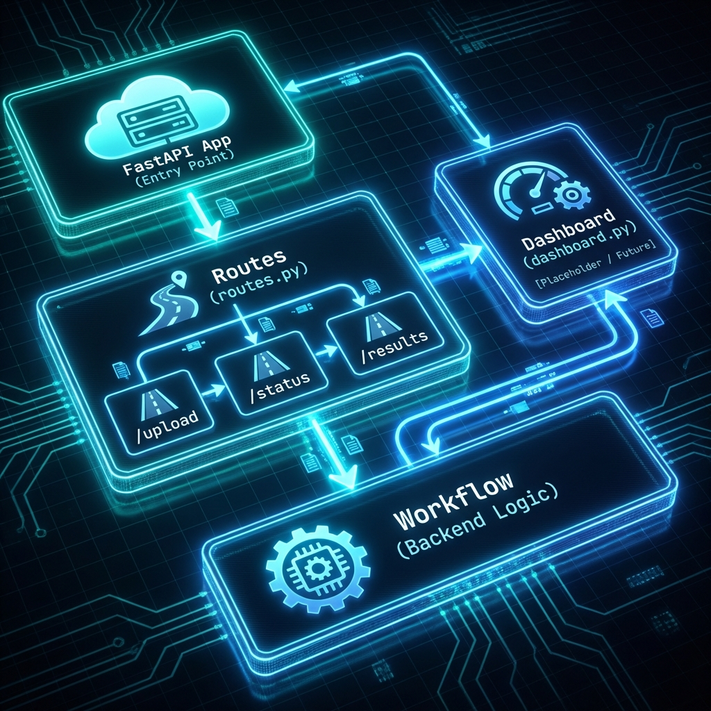

# 🌐 API Module (`src/api`)

Interfaz REST para la interacción con sistemas externos.

## 🖼️ Arquitectura

## 📋 Responsabilidades
1.  **Endpoints**: Exponer funcionalidad del workflow vía HTTP.
2.  **Dashboard**: Backend para el panel de control (Streamlit/Web).

## 📂 Estructura
*   `routes.py`: Definición de endpoints (FastAPI).
*   `dashboard.py`: Lógica de visualización.
*   `app.py`: Configuración del servidor.

> [!NOTE]
> Este módulo está actualmente en desarrollo inicial.
