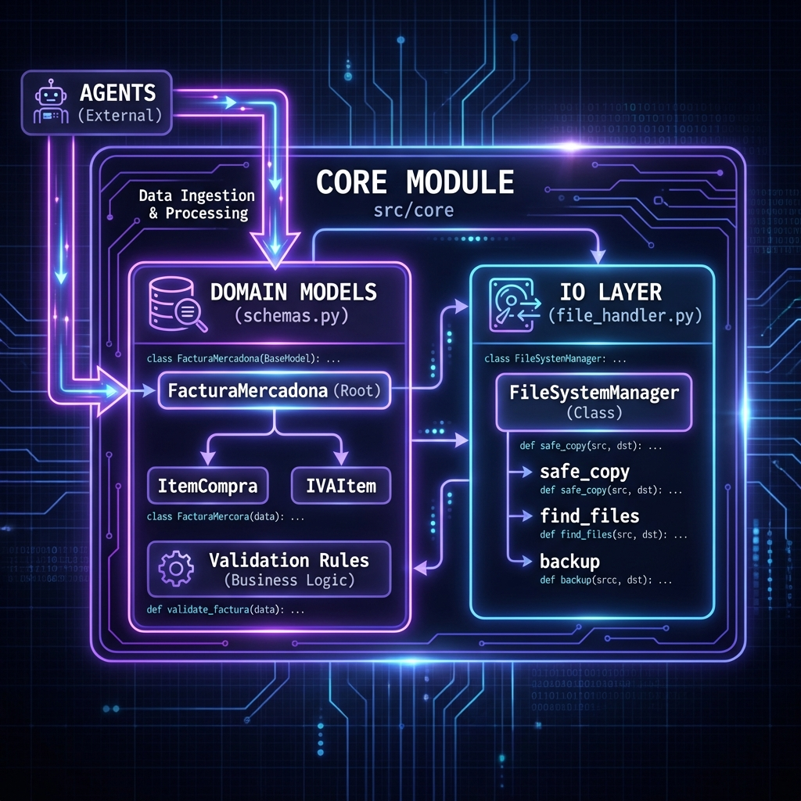

# Especificación Técnica: Core y Configuración

3. ## 📋 Índice
3. ## Índice
4. 1. [Descripción General](#descripcion-general)
5. 2. [Componentes Principales](#componentes-principales)
6.     - [Sistema de Configuración](#sistema-de-configuracion)
7.     - [Core Schemas](#core-schemas)
8.     - [File Handler](#file-handler)
9.     - [Manejo de Excepciones](#manejo-de-excepciones)
10. 3. [Detalles de Implementación](#detalles-de-implementacion)

---

## Descripción General {#descripcion-general}



[...]

## Componentes Principales {#componentes-principales}

### Sistema de Configuración {#sistema-de-configuracion}

[...]

### Core Schemas {#core-schemas}

[...]

### File Handler {#file-handler}

[...]

### Manejo de Excepciones {#manejo-de-excepciones}

[...]

## 💻 Detalles de Implementación {#detalles-de-implementacion}

### Configuración del Sistema (`config/`)

#### 1. `config/settings.py` (Environment)
Define la carga de variables de entorno usando `pydantic-settings`.
*   **Clase**: `Settings`
*   **Hereda de**: `BaseSettings`
*   **Responsabilidad**: Singleton que carga `.env`.
*   **Campos**:
    *   `app_name`: str
    *   `debug`: bool
    *   `log_level`: str
    *   `llm`: `LLMConfig`
    *   `ocr`: `OCRConfig`
    *   `storage`: `StorageConfig`
    *   `validation`: `ValidationConfig`

#### 2. `config/config.py` (Domain Models)
Define los modelos de dominio para la configuración.
*   **Clases**:
    *   `LLMConfig`: `provider`, `model`, `api_key`, `temperature`.
    *   `OCRConfig`: `provider`, `language`, `tesseract_cmd`.
    *   `StorageConfig`: `base_path`, `input_dir`, `output_dir`.
    *   `ValidationConfig`: `confidence_threshold`, `strict_mode`.
*   **Métodos**:
    *   `update_from_json(path)`: Permite sobreescribir valores desde un JSON.

#### 3. `config/config.json` (Defaults)
Archivo JSON estático con valores por defecto para entornos de desarrollo/local.

#### 4. `config/__init__.py`
Exporta una instancia global `settings` lista para usar.
```python
from .settings import Settings
settings = Settings()
```

### Excepciones (`src/core/exceptions.py`)
```python
class BaseError(Exception):
    """Base para todas las excepciones del proyecto"""
    pass

class ConfigurationError(BaseError):
    """Error en carga de configuración"""
    pass
```
