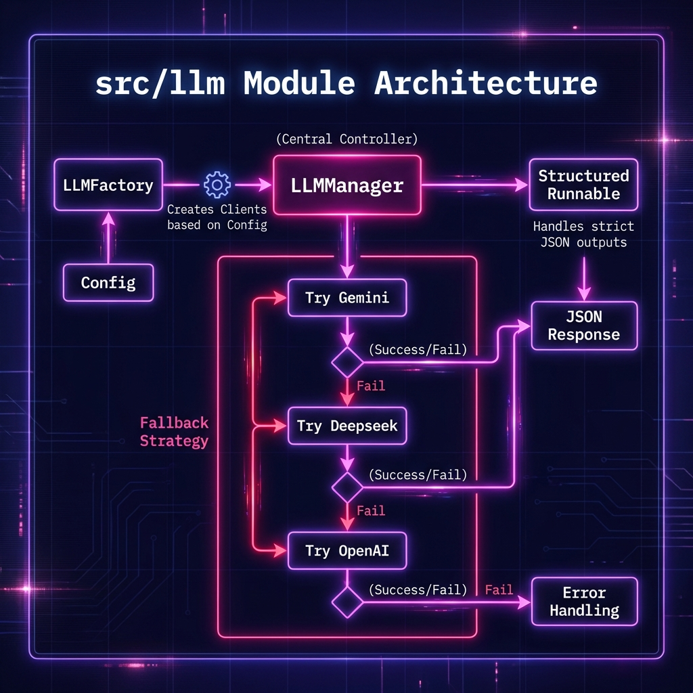

# 🧠 LLM Manager Module (`src/llm`)

Este módulo centraliza la gestión de Grandes Modelos de Lenguaje (LLMs) y la lógica de fallback.

## 🖼️ Arquitectura

## 📋 Responsabilidades
1.  **Factory Pattern**: Crear clientes de LangChain (OpenAI, Gemini, Deepseek) bajo demanda.
2.  **Fallback Strategy**: Si el modelo principal falla (Rate Limit, API Error), reintenta automáticamente con el siguiente en la lista.
3.  **Structured Output**: Normaliza la obtención de JSONs estrictos entre diferentes proveedores.

## 📂 Estructura
*   `llm_manager.py`: Lógica principal del gestor y factory.
*   `providers.py`: (Opcional) Definiciones específicas de proveedores.
*   `prompt_templates.py`: Plantillas de prompts reutilizables.
