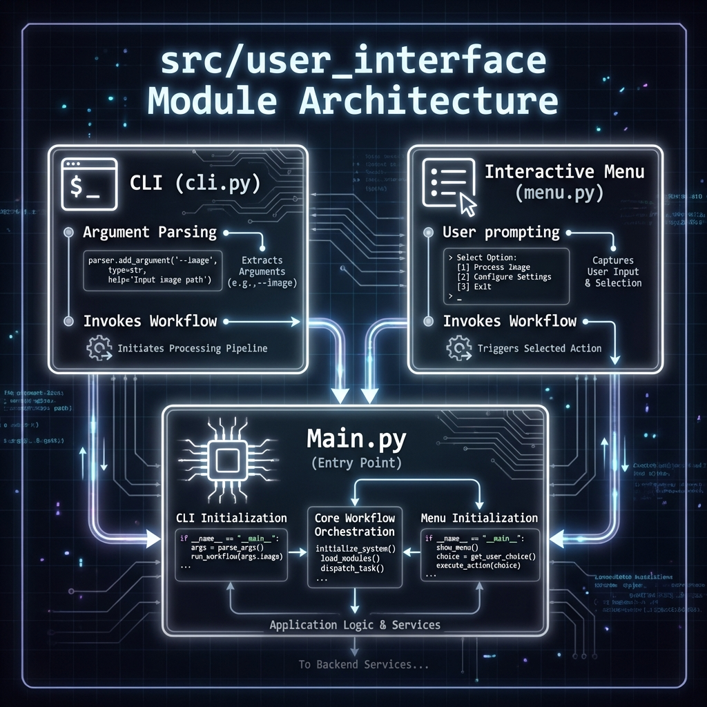

# 🖥️ User Interface Module (`src/user_interface`)

Punto de entrada para la interacción humana con el sistema.

## 🖼️ Arquitectura

## 📋 Responsabilidades
1.  **CLI (Command Line Interface)**: Ejecución rápida mediante argumentos (ej: `--image`).
2.  **Menu Interactivo**: Wizard de texto para guiar al usuario paso a paso.
3.  **Abstracción**: Desacopla la lógica de negocio (`src/workflow`) de la capa de presentación.

## 📂 Estructura
*   `cli.py`: Entrada basada en `argparse`.
*   `menu.py`: Lógica de menús interactivos.
