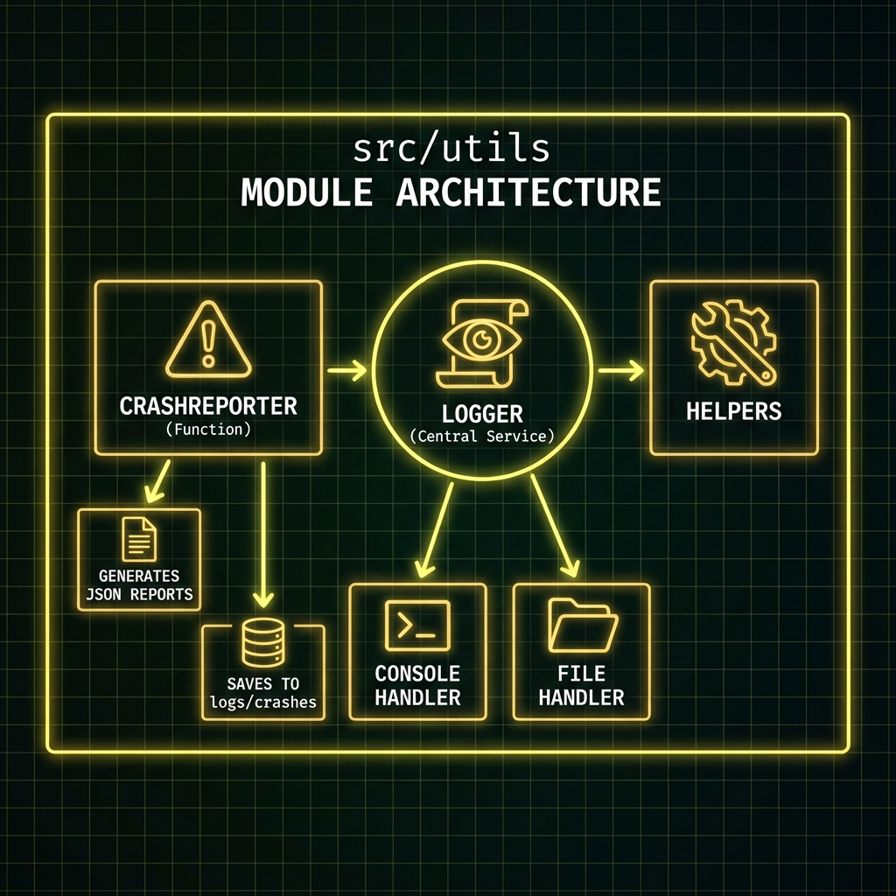

# 🛠️ Utilities Module (`src/utils`)

Colección de herramientas transversales y helpers del sistema.

## 🖼️ Arquitectura

## 📋 Responsabilidades
1.  **Logging Centralizado**: Configuración única de logs para todo el sistema (Consola + Archivo).
2.  **Crash Reporting**: Sistema de captura de excepciones que genera reportes JSON detallados en `logs/crashes/` para depuración post-mortem.
3.  **Helpers**: Funciones auxiliares genéricas.

## 📂 Estructura
*   `logger.py`: Configuración de logging y función `generate_crash_report`.
*   `helpers.py`: Utilidades varias.
*   `validators.py`: Validadores genéricos (no de negocio).
