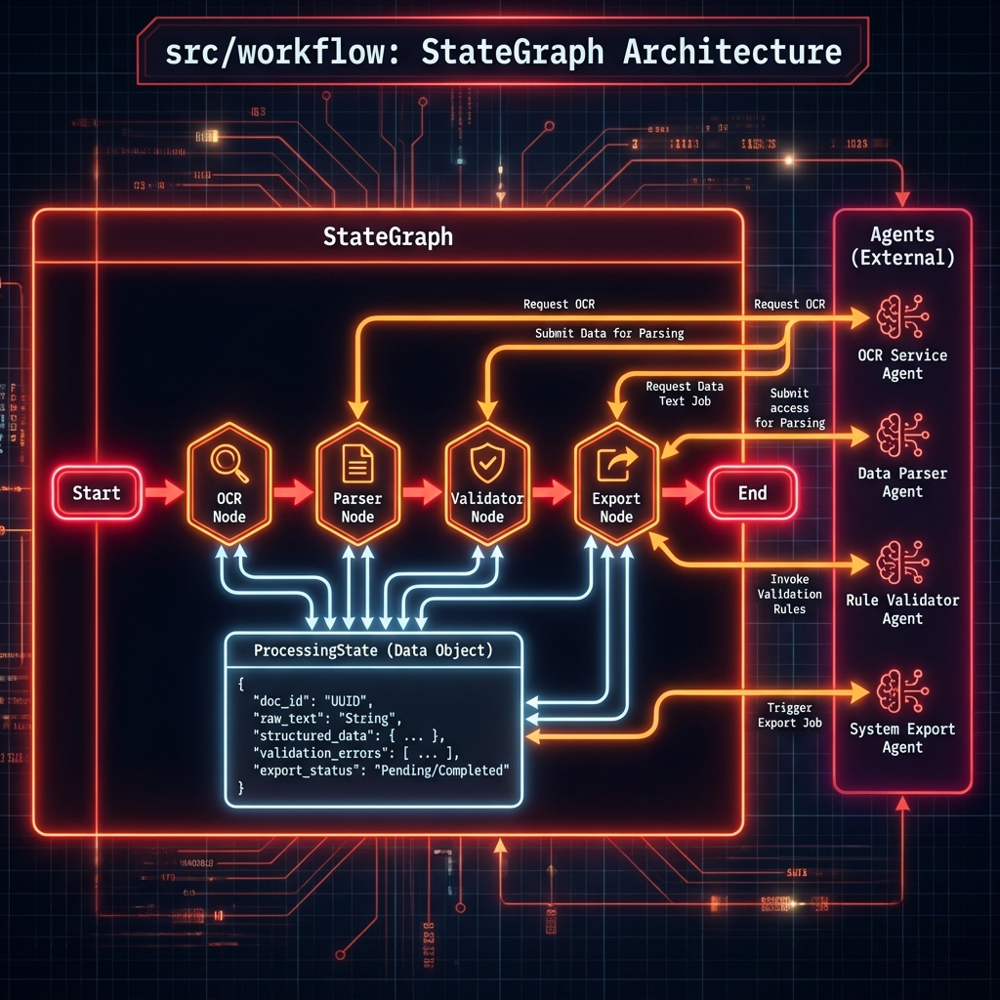

# Especificación Técnica: Workflow y Orquestación

3. ## Índice
4. 1. [Descripción General](#descripcion-general)
5. 2. [Estado del Sistema](#estado-del-sistema)
6. 3. [Grafo de Procesamiento](#grafo-de-procesamiento)
7. 4. [Manejo de Errores](#manejo-de-errores)

---

## Descripción General {#descripcion-general}

[...]

## Estado del Sistema {#estado-del-sistema}

[...]

## Grafo de Procesamiento {#grafo-de-procesamiento}

[...]

## Manejo de Errores {#manejo-de-errores}
El sistema debe ser capaz de recuperarse de fallos transitorios (ej. error de red con LLM) y reportar fallos definitivos sin romper la ejecución del lote completo.
