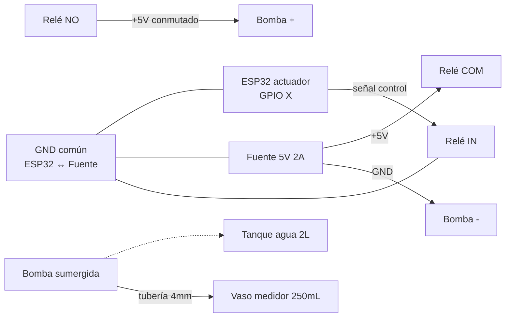

SPIKE: Validación de bomba 5V para riego automático
Autor: Daniel Montero Fernández
Fecha inicio: <!-- rellenar al empezar (YYYY-MM-DD) -->
Fecha cierre: <!-- rellenar al cerrar (YYYY-MM-DD) -->
Timebox: 3 días (máximo 9 horas efectivas)
Estado: 🟡 Pendiente
Decisión final: <!-- rellenar al cerrar: continuar | pivotar | abortar -->
Coste real total: <!-- rellenar al cerrar -->

> **Tipo**: Spike (Extreme Programming) — exploración timeboxed con montaje y código descartables. El objetivo es **aprendizaje + decisión binaria**, no producción final. Si pasa el timebox sin resolverse, se reevalúa la hipótesis (no se extiende el plazo).

---

## 1. Contexto y Motivación

El Proyecto Demeter cierra como **v1.0 release** (ver pivote estratégico en el vault de conocimiento personal del autor). La pieza que falta para considerar el sistema funcional end-to-end es el **riego automático**: hasta ahora se ha desarrollado monitorización (sensores), comunicación (protocolo Demeter), backend, frontend y LIMS, pero la actuación física sobre el entorno se limita a comandos GPIO genéricos sin integración con bombas reales.

Antes de comprar 4-5 bombas, módulos relé adicionales, fuentes de alimentación, tubería y tanque (~50-80€ de inversión), conviene **validar con una sola bomba** que la cadena completa funciona como se espera. Esta validación es un **spike**: se descarta el código y montaje al terminar, lo que sobrevive es el aprendizaje y la decisión.

**Lo que SÍ valida este spike:**

- Que una bomba 5V mini sumergible puede mover agua en una situación real (no solo en spec).
- Que el módulo relé existente del kit Demeter soporta la corriente de la bomba.
- Que el comando `set_gpio` actual (CMD ID `0x10`) sirve sin modificaciones de firmware.
- Que el caudal real es predecible y suficiente para regar una maceta.
- Que la bomba aguanta uso continuo y cíclico sin degradación inmediata.

**Lo que NO valida este spike:**

- La integración con LIMS, secuenciador o frontend (eso es la siguiente fase).
- El comportamiento en exterior con humedad/temperatura ambiente.
- La durabilidad a largo plazo (> 1 mes).
- La configuración con 4-5 bombas simultáneas y red de distribución.
- El ajuste agronómico de volúmenes de riego por especie.

## 2. Objetivo

Validar si **una bomba mini sumergible 5V DC** puede mover agua del tanque a una maceta, **controlada vía relé desde un nodo actuador ESP32 existente** mediante el comando `set_gpio` ya implementado en el protocolo Demeter, con **caudal predecible** y **sin sobrecalentamiento** en uso normal.

## 3. Hipótesis

Cinco hipótesis testables, cada una con predicción + criterio de éxito.

### H1 — Caudal real próximo a la especificación

- **Predicción**: caudal medido entre 80–120 L/h (1.3–2.0 mL/s) según la spec del fabricante de bombas R385 / R365.
- **Cómo medir**: cronometrar el tiempo en llenar un volumen conocido (250 mL) tras 60 s de bombeo continuo.
- **Criterio de éxito**: caudal medido ≥ 1.0 mL/s (60 mL/min mínimo). Por debajo de eso, las secuencias de riego serían demasiado lentas para uso práctico.

### H2 — Corriente de la bomba dentro del rango del relé

- **Predicción**: la bomba consume entre 0.2 y 0.5 A a 5 V en operación normal.
- **Cómo medir**: multímetro en serie con la bomba durante operación de 30 s.
- **Criterio de éxito**: corriente máxima ≤ corriente nominal del módulo relé (típicamente 10 A en módulos comunes, así que cualquier valor < 1 A pasa con margen amplio).

### H3 — El comando `set_gpio` actual sirve sin cambios software

- **Predicción**: enviando `{"type": "set_gpio", "target_id": <ID actuador>, "pin": <pin libre>, "value": 1}` desde la API o el frontend, la bomba se activa; con `value: 0` se apaga.
- **Cómo medir**: ejecutar el comando vía `POST /api/command` (ver `docs/Backend_Dominio.md`) y observar el comportamiento físico.
- **Criterio de éxito**: la bomba se activa y desactiva correctamente sin necesidad de modificar firmware ni añadir código en backend.

### H4 — Tiempo razonable para regar una maceta

- **Predicción**: regar una cantidad típica para una maceta pequeña-media (~150 mL) requiere menos de 30 s.
- **Cómo medir**: cronometrar el tiempo necesario para acumular 150 mL en el vaso medidor.
- **Criterio de éxito**: t ≤ 30 s. Si t > 60 s, las secuencias resultarían incómodas y habría que considerar bombas más potentes.

### H5 — Tolerancia a uso continuo sin sobrecalentamiento

- **Predicción**: la bomba tolera 5 minutos de operación continua sin signos de sobrecalentamiento perceptibles al tacto exterior de la carcasa.
- **Cómo medir**: operar 5 min seguidos y comprobar temperatura de la carcasa al final (al tacto o con termómetro IR si hay).
- **Criterio de éxito**: la carcasa permanece fría o ligeramente templada (estimación < 40 °C). Calor intenso indica problema de diseño o mal acople hidráulico (rozamiento sin agua suficiente).

## 4. Materiales necesarios

| Componente                              | Cantidad | Coste estimado | Fuente sugerida          | Notas                                             |
|-----------------------------------------|----------|----------------|--------------------------|---------------------------------------------------|
| Bomba 5 V DC mini sumergible (R385)     | 1        | ~5 €           | Amazon / AliExpress      | Buscar "mini water pump 5V Arduino"               |
| Fuente 5 V 2 A con plug                 | 1        | ~10 €          | Amazon / tienda local    | Independiente del ESP32 (no compartir)            |
| Módulo relé 1-canal (5 V activación)    | 1        | 0 €            | Reutilizar del kit Demeter | Verificar que el módulo es de 5 V lógica          |
| Tubería de silicona 4–6 mm (Ø interior) | ~1 m     | ~3 €           | Amazon / acuariofilia    | Solo para pruebas, longitud final puede variar    |
| Recipiente / tanque (≥ 2 L)             | 1        | 0 €            | Casa                     | Cualquier tupperware o garrafa abierta            |
| Vaso medidor (250 mL graduado)          | 1        | 0 €            | Casa                     | Para medir caudal                                 |
| **TOTAL ESTIMADO**                      |          | **~18 €**      |                          |                                                   |

**Instrumentos requeridos (no consumibles):**

- Multímetro (con escala de corriente DC, idealmente ≥ 1 A).
- Cronómetro (móvil sirve).
- ESP32 actuador del kit Demeter, ya flasheado con el firmware actual.
- Raspberry Pi Demeter encendida y conectada al backend (local o GCP) para enviar comandos vía dashboard o `curl`.
- Termómetro IR (opcional — al tacto basta para H5).

## 5. Setup experimental

### 5.1 Diagrama de conexionado



### 5.2 Pin GPIO a utilizar

Consultar `docs/Manuals/Firmware_Flash_Guide.md` para identificar un pin GPIO libre en el nodo actuador. Se recomienda usar el mismo pin que ya esté contemplado en la lógica de actuadores del firmware para evitar tocar código.

**Pin elegido**: <!-- rellenar con número GPIO real, ej: GPIO 5 -->

### 5.3 Notas de seguridad eléctrica

- **Nunca** alimentar la bomba directamente desde la línea de 5 V del ESP32 (el regulador onboard no aguanta esa corriente).
- Verificar continuidad GND entre ESP32, relé y fuente externa **antes** de aplicar tensión.
- Al sumergir la bomba, asegurar que **solo el cuerpo de la bomba** entra en el agua, **nunca los terminales eléctricos**.
- El tanque debe estar a un nivel que permita succión (la bomba necesita estar sumergida — no bombea aire).
- Si la bomba hace ruido extraño o se calienta, **cortar inmediatamente** la alimentación.

### 5.4 Comando de prueba (para enviar desde dashboard o curl)

```bash
# Activar la bomba 10 segundos vía API REST (ejemplo)
curl -X POST http://<host>/api/command \
  -H "Content-Type: application/json" \
  -H "Authorization: Bearer <token>" \
  -d '{
    "type": "set_gpio",
    "target_id": <ID del nodo actuador>,
    "pin": <pin GPIO de prueba>,
    "value": 1
  }'

# Tras N segundos, apagar:
curl -X POST http://<host>/api/command \
  -H "Content-Type: application/json" \
  -H "Authorization: Bearer <token>" \
  -d '{
    "type": "set_gpio",
    "target_id": <ID del nodo actuador>,
    "pin": <pin GPIO de prueba>,
    "value": 0
  }'
```

Referencia detallada del comando: `docs/Backend_Dominio.md` (sección de comandos `set_gpio`, CMD ID `0x10`).

## 6. Plan de tests

Se ejecutan **en orden**. Si un test falla críticamente (especialmente el primero), parar y reevaluar antes de continuar.

### Test 1 — Activación básica (15 min) → valida H3

**Objetivo**: confirmar que el comando `set_gpio` actual activa la bomba sin cambios software.

**Procedimiento:**

1. Montar el circuito según el diagrama (sin agua todavía, bomba en seco).
2. Encender ESP32 y verificar conexión con la red Demeter.
3. Enviar comando `set_gpio` con `value: 1` y observar el clic del relé.
4. Verificar que el relé conmuta y que llegan 5 V a los terminales de la bomba (multímetro).
5. Enviar `value: 0` y verificar que el relé vuelve al estado abierto.

> **Nota**: en este test la bomba no debe estar en agua. Solo se valida la cadena de control eléctrica. **No mantener la bomba en seco más de 5 segundos** (algunas bombas se dañan por fricción interna sin agua).

**Resultado esperado**: el relé conmuta de forma fiable y los 5 V llegan a la bomba al ordenar `value: 1`.

**Resultado real**: <!-- rellenar -->

### Test 2 — Corriente real (15 min) → valida H2

**Objetivo**: medir la corriente real consumida por la bomba en operación.

**Procedimiento:**

1. Sumergir la bomba en el tanque con agua.
2. Conectar el multímetro en serie en la línea positiva de la bomba (escala DCA).
3. Activar la bomba 30 s.
4. Anotar corriente máxima al arranque y promedio en operación estable.
5. Apagar.

**Resultado esperado**: arranque < 1 A, operación estable 0.2–0.5 A.

**Resultado real**:

| Métrica                   | Valor medido |
|---------------------------|--------------|
| Corriente arranque (peak) | <!-- A -->   |
| Corriente operación       | <!-- A -->   |
| Tensión bomba             | <!-- V -->   |

### Test 3 — Caudal medido (30 min) → valida H1

**Objetivo**: medir el caudal real en condiciones reales (con tubería y altura de elevación típicas).

**Procedimiento:**

1. Bomba sumergida, tubería de salida apuntando al vaso medidor.
2. Activar la bomba durante exactamente 60 s con cronómetro.
3. Medir volumen acumulado en el vaso.
4. Repetir 3 veces.
5. Calcular caudal medio en mL/s.

**Resultado esperado**: caudal medio entre 80–120 L/h (1.3–2.0 mL/s).

**Resultado real**:

| Repetición | Tiempo (s) | Volumen (mL) | Caudal (mL/s) |
|------------|------------|--------------|---------------|
| 1          | 60         | <!-- -->     | <!-- -->      |
| 2          | 60         | <!-- -->     | <!-- -->      |
| 3          | 60         | <!-- -->     | <!-- -->      |
| **Media**  |            |              | <!-- -->      |

### Test 4 — Tiempo para riego típico (30 min) → valida H4

**Objetivo**: determinar el tiempo necesario para entregar un volumen de riego típico.

**Procedimiento:**

1. Calcular tiempo teórico para 150 mL a partir del caudal medio del Test 3.
2. Activar la bomba durante ese tiempo.
3. Verificar volumen real acumulado.
4. Repetir 5 veces para evaluar consistencia.
5. Calcular variabilidad (desviación estándar).

**Resultado esperado**: tiempo total ≤ 30 s, variabilidad < ±10 %.

**Resultado real**:

| Repetición | Tiempo (s) | Volumen real (mL) | Desviación (mL) |
|------------|------------|--------------------|-----------------|
| 1          | <!-- -->   | <!-- -->           | <!-- -->        |
| 2          | <!-- -->   | <!-- -->           | <!-- -->        |
| 3          | <!-- -->   | <!-- -->           | <!-- -->        |
| 4          | <!-- -->   | <!-- -->           | <!-- -->        |
| 5          | <!-- -->   | <!-- -->           | <!-- -->        |
| **Media**  |            |                    |                 |

### Test 5 — Continuidad térmica (1 h) → valida H5

**Objetivo**: comprobar que la bomba aguanta uso continuo sin sobrecalentamiento.

**Procedimiento:**

1. Activar la bomba 5 min seguidos sumergida.
2. Tras los 5 min, **antes de apagar**, comprobar temperatura de la carcasa (tacto o termómetro IR).
3. Apagar y dejar enfriar 10 min.
4. Repetir el ciclo una vez más para confirmar.

**Resultado esperado**: carcasa fría o templada (< 40 °C estimado).

**Resultado real**:

| Ciclo | Temp. estimada al final | Comportamiento (ruido, vibración, etc.) |
|-------|--------------------------|------------------------------------------|
| 1     | <!-- °C / al tacto -->   | <!-- -->                                 |
| 2     | <!-- °C / al tacto -->   | <!-- -->                                 |

### Test 6 — Ciclos repetidos (30 min) → valida H1 + H4 estabilidad

**Objetivo**: comprobar que la bomba entrega volumen consistente a lo largo de muchos ciclos cortos (similar al uso real de riego programado).

**Procedimiento:**

1. Programar 10 ciclos de 30 s ON / 30 s OFF (manual o vía secuenciador si está activo).
2. En cada ciclo, vaciar el vaso medidor y registrar volumen entregado.
3. Anotar cualquier degradación visible (caudal descendente, ruido, fallos).

**Resultado esperado**: volumen consistente entre ciclos (variación < ±10 %), sin fallos.

**Resultado real**:

| Ciclo | Volumen (mL) |
|-------|--------------|
| 1     | <!-- -->     |
| 2     | <!-- -->     |
| 3     | <!-- -->     |
| 4     | <!-- -->     |
| 5     | <!-- -->     |
| 6     | <!-- -->     |
| 7     | <!-- -->     |
| 8     | <!-- -->     |
| 9     | <!-- -->     |
| 10    | <!-- -->     |
| **Media** |          |
| **Desv.** |          |

## 7. Tabla resumen de resultados

| Test | Hipótesis validada | Resultado | Pasa / Falla | Notas |
|------|--------------------|-----------|--------------|-------|
| 1    | H3                 | <!-- --> | <!-- ✅/❌ -->| <!-- -->|
| 2    | H2                 | <!-- --> | <!-- ✅/❌ -->| <!-- -->|
| 3    | H1                 | <!-- --> | <!-- ✅/❌ -->| <!-- -->|
| 4    | H4                 | <!-- --> | <!-- ✅/❌ -->| <!-- -->|
| 5    | H5                 | <!-- --> | <!-- ✅/❌ -->| <!-- -->|
| 6    | H1+H4 (estabilidad)| <!-- --> | <!-- ✅/❌ -->| <!-- -->|

## 8. Aprendizajes

> Anotar **durante** el spike, no al final. Cualquier observación inesperada cuenta.

- <!-- bullet 1 -->
- <!-- bullet 2 -->
- <!-- bullet 3 -->

**Sorpresas (positivas o negativas):**

- <!-- -->

**Cosas que cambiaría si repitiera el spike:**

- <!-- -->

## 9. Decisión final

> Marcar **una** opción y justificar con datos.

- [ ] **CONTINUAR** — todas las hipótesis validadas, proceder con compra de 4 bombas adicionales + módulo relé multi-canal y avanzar a integración con la red Demeter.
- [ ] **PIVOTAR** — al menos una hipótesis falla pero hay alternativa identificada. Cambiar:
    - <!-- p.ej. "bomba dosificadora peristáltica más precisa" / "MOSFET en lugar de relé por ruido" / "bomba 12V con regulador" -->
- [ ] **ABORTAR** — replantear estrategia de riego completamente. Posibles alternativas a explorar:
    - Riego por gravedad con válvulas solenoide.
    - Sistema de goteo presurizado.
    - Suspender el subsistema de riego en v1.0 y limitar a monitorización.

**Justificación basada en datos:**

<!-- rellenar con razonamiento referenciando los tests -->

## 10. Próximos pasos

### Si la decisión es CONTINUAR

1. Compra: 4 bombas adicionales + 1 módulo relé 4-canal + tubería suficiente para distribución + tanque definitivo.
2. Diseño de la red de distribución (1 bomba ↔ 1 maceta, sin válvulas distribuidoras inicialmente).
3. Integración con secuenciador del backend para riego programado.
4. Tests de integración con las 4-5 bombas en paralelo.
5. Estabilización 30 días en uso real (criterio de DONE de v1.0).

### Si la decisión es PIVOTAR

1. <!-- rellenar según pivote elegido -->

### Si la decisión es ABORTAR

1. Documentar lecciones aprendidas en `docs/Architecture/LaTeX/sections/` (capítulo de conclusiones).
2. Definir el alcance reducido de v1.0 sin riego (monitorización + control manual de actuadores genéricos).
3. Reflejar la decisión en el Informe de Viabilidad del cierre.

## 11. Referencias internas al proyecto

- Comando `set_gpio` (CMD ID `0x10`): `docs/Backend_Dominio.md`, sección de comandos.
- Pines GPIO disponibles en nodo actuador: `docs/Manuals/Firmware_Flash_Guide.md`.
- Documentación técnica completa: `docs/Architecture/LaTeX/main.pdf`.
- Estilo de tests hardware previos: `docs/deep_sleep_test.md`.
- Tests del firmware: `Firmware/test/`.
- Plan de cierre del proyecto (v1.0 release): documento en el vault de conocimiento personal del autor.

## 12. Cierre del spike

Al finalizar el spike (sea cual sea la decisión):

- [ ] Actualizar campos `Estado`, `Fecha cierre`, `Decisión final` y `Coste real total` en la cabecera.
- [ ] Mover archivos de código provisional creado (si los hay) a una carpeta `archived/` o eliminar — el código del spike NO va a la rama principal del firmware.
- [ ] Si la decisión implica cambios arquitectónicos, abrir un ADR posterior referenciando este spike.
- [ ] Comunicar resultado a la asociación si afecta al cierre del Proyecto Docente.
